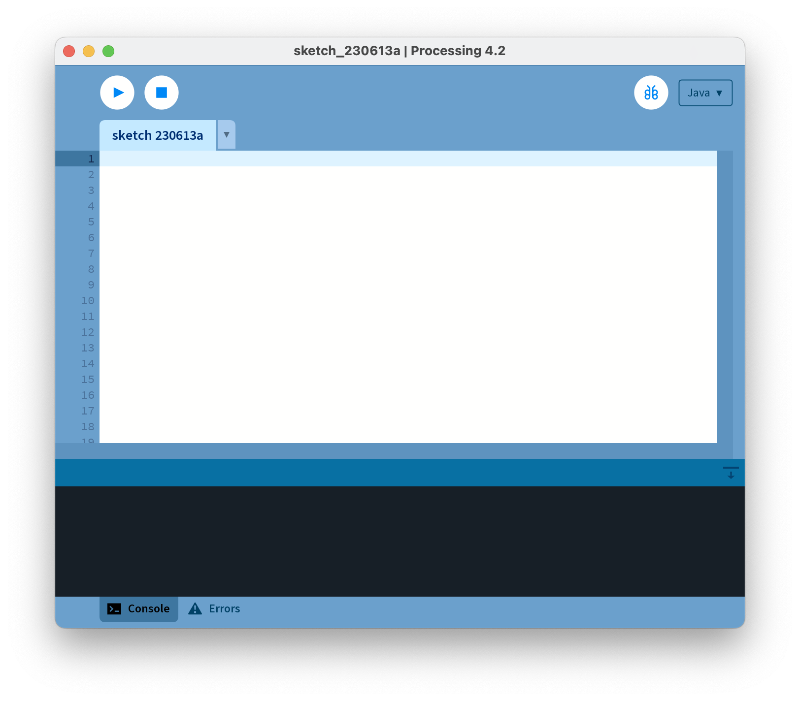

## Opening the PDE (1)

### If you are using the College Computers...

Open Windows Explorer by holding down the windows key and pressing the letter E once. 

When Windows Explorer opens, double click on:

- the **C:** 

- then the **dev** folder

- then the **processing** folder

- then the **processing-x.x.x** folder

### If you are using your own computer...

Go to the directory/folder where you installed your processing app.  

## Opening the PDE (2)

Now that you have navigated to where Processing is installed, you should see a list of files and folders similar to the picture below:

Double click in the **processing** application (highlighted by the red rectangle).

The PDE (Processing Development Environment) should launch.

