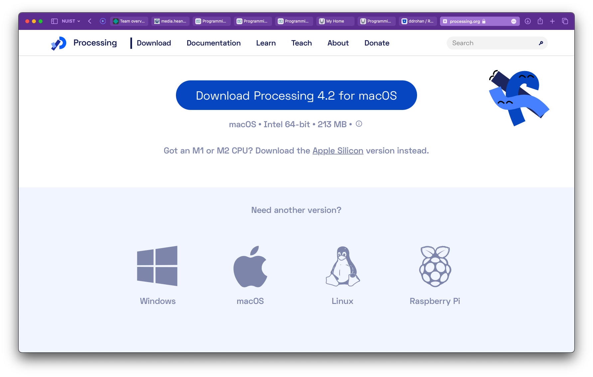
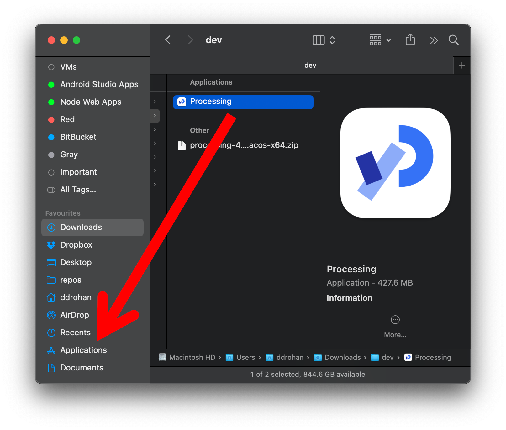
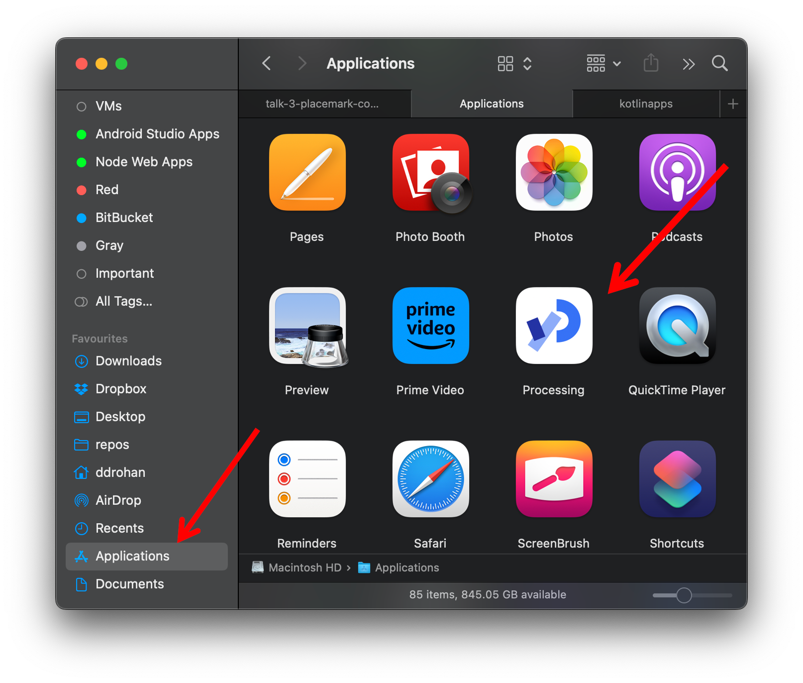

## Installing the PDE (Processing Development Environment)

- If you are using your own laptop and would like to install the PDE on it, please follow the instructions in this step.
- If you are using the WIT computers, you can ignore this step and move onto the next step.

## Downloading the PDE

- The PDE can be downloaded from <https://processing.org/>.  It is free, but you can choose to make a donation if you wish.

- Choose the version you need (for me it's macOS)

- A zip file will start to download.  When this file has downloaded, you will store this differently depending on your operating system.

## Windows
   - Decide where you are going to store your Programming applications on your computer.   It is a good idea to create a folder called **dev** on your **C:** Drive and store all your applications in there.
   - Unzip the downloaded processing file to your chosen location.  Note: if you don’t have unzipping software, 7-zip is a good choice and can be downloaded from here: <http://www.7-zip.org/>.
   - You should now have a folder structure resembling this picture:

## Mac
   - Unzip the downloaded .zip file (by double-clicking on the zip file in the downloads folder)
   - Drag the resulting folder to the Applications folder (on Mac, this holds all the applications). Note that it is useful/usual to have the Applications Folder in the 'Favourites' section in Finder. 

   - Your Applications folder should now contain the Processing application.  (Version Numbers may differ slightly)
