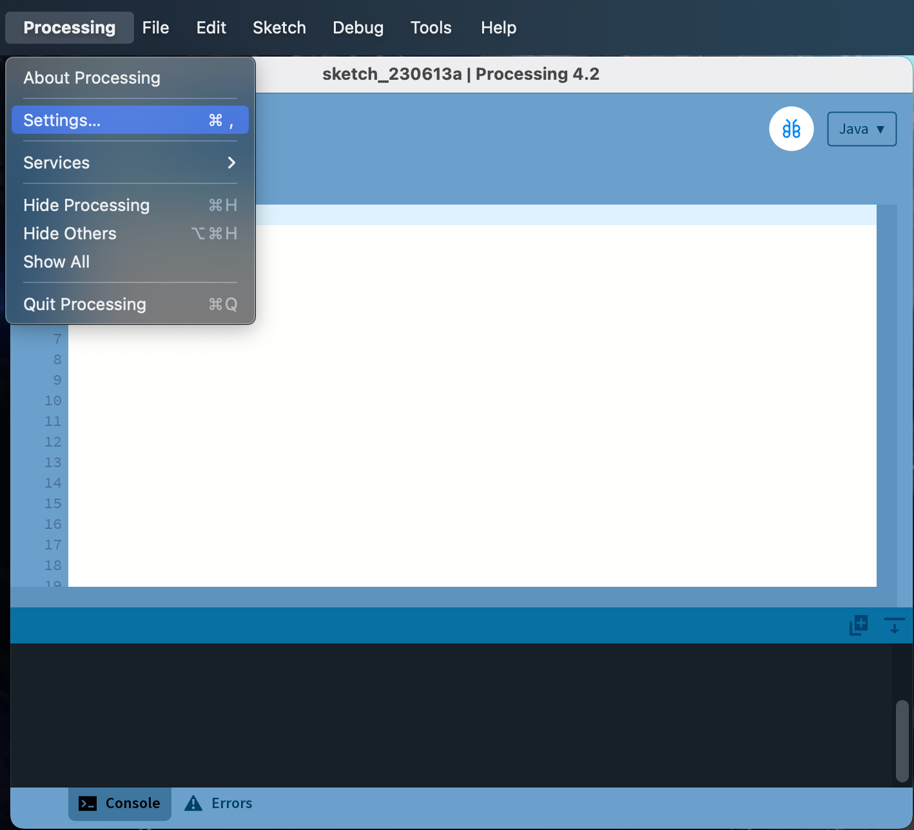
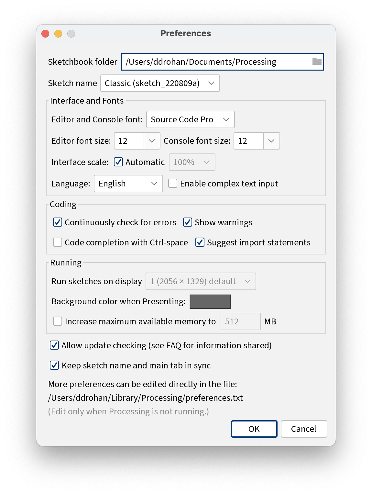
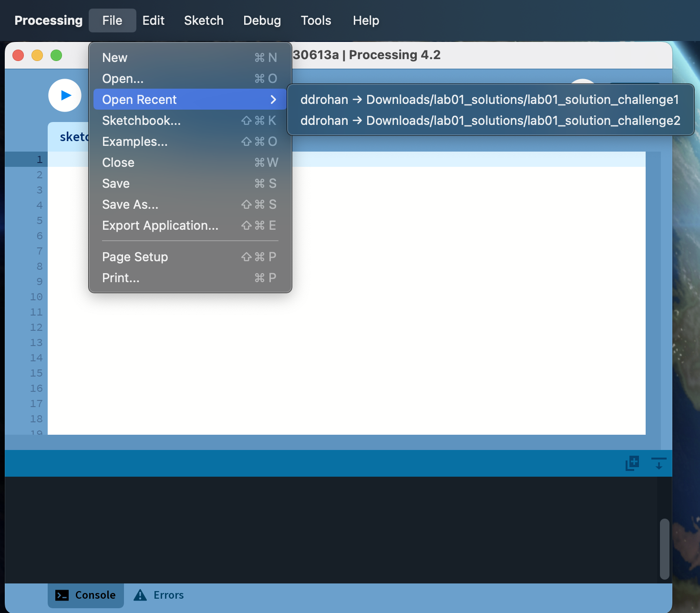

## Setting your Sketchbook location

- As you work through the exercises in this lab, you will create many new files.  These files are called Sketchbooks.
- It is important that you pick a convenient location on your computer to save these sketchbook files to.  The following steps show you how to do this.

## Updating your Sketchbook location

- If you don't have Processing open, launch it (see the previous step for the steps involved).
- From the **Processing/File**  menu, select the **Settings** menu item (on **Mac** here) or the **Preferences** menu item (on Windows).

- The following window should appear.

- In the **Sketchbook Folder / location**, enter a location that is convenient to you.  If you are using:
    - the college computers, it could be your G:\ (personal networked drive that is accessible only using college computers) or a USB drive (remember to back up your work if you are using a portable drive).
    - your own laptop, choose a convenient location where you will store all your programming exercises.
- Click the OK button.

## The Sketchbook location

- All your work can now be accessed easily by selecting the **Sketchbook**  option from the **File** menu. An example of previous Sketchbook work could look like this:

