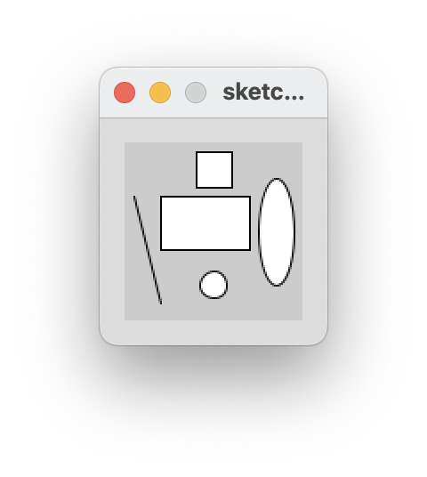

## Drawing Simple Shapes(contd.)

### Drawing Ellipses

- For our purposes here, we will define an **ellipse** as a basic oval shape. 

- The syntax of the **ellipse** function is:

~~~
    ellipse(x, y, w, h)
        x = x-coordinate at the centre of the ellipse
        y = y-coordinate at the centre of the ellipse
        w = width of the ellipse
        h = height of the ellipse
~~~

- In the following picture, you can see an example of an ellipse. 

- Enter the following code in your open sketchbook:

~~~java
    ellipse(85,50,20,60);
~~~

- When you run the code, you should see the following ellipse whose centre is (85,50) and is 20 pixels wide and 90 high.

### Drawing Circles

- Using the ellipse() function, you can draw circles. Just set the width and height to the same number of pixels.

- Try drawing a circle that has the coordinates (50,80) at its centre and has a diameter of 15 pixels.

- Run the code.  Did a circle appear?

