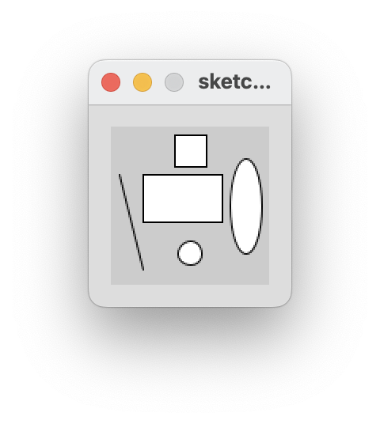
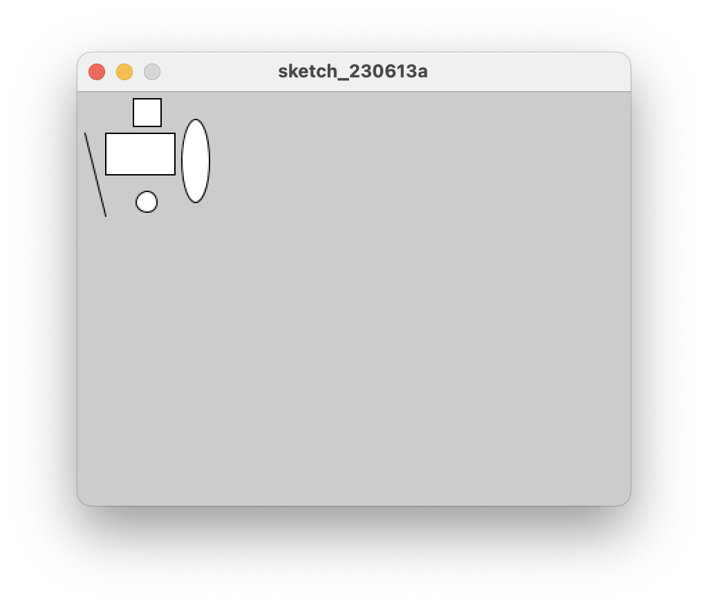
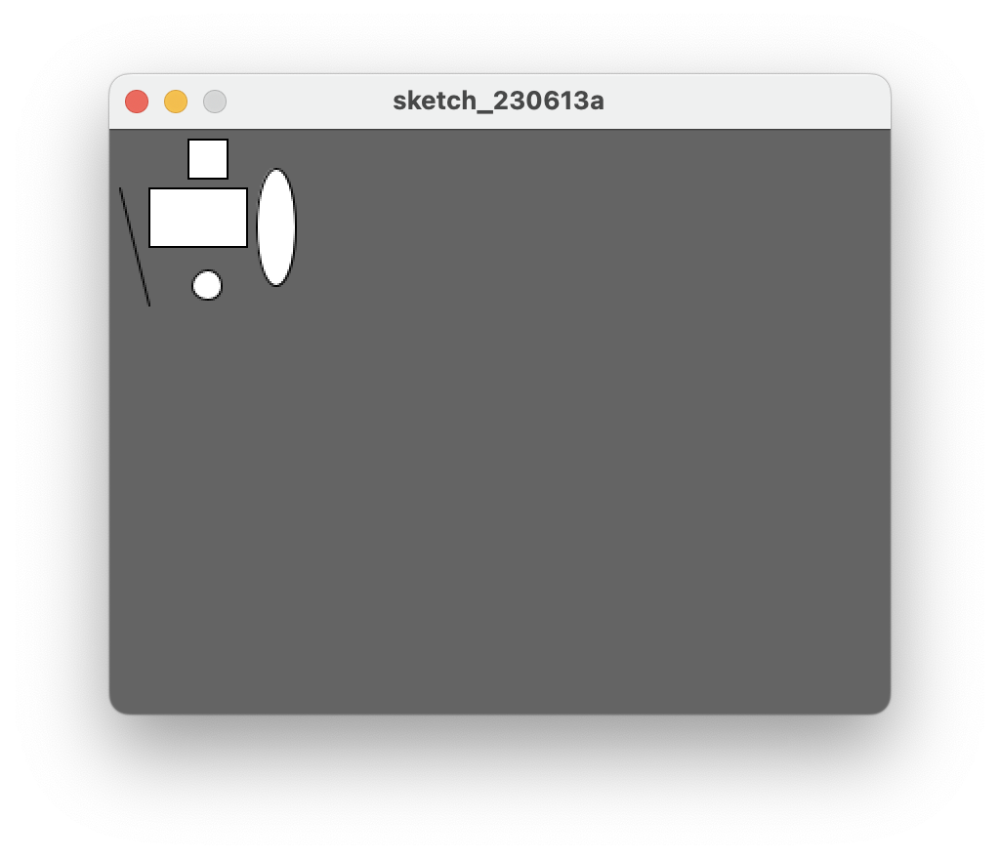

## Changing the look of the display window

- You should have the following code in your open sketchbook:

~~~java
	rect(20,30,50,30);
	rect(40,5,20,20);
	line(5,30,20,90);
	ellipse(85,50,20,60);
    ellipse(50,80,15,15);
~~~

- When it runs, you should have something that looks like this:

- We can see that the available space in the window is at a minimum and the window is quite small.  There background is also a default light grey colour.  We will make changes to this code to make the window larger and change the colour.

### size() function

- The size() function sets the size of the display window in pixels.  It has to be the first line of code in your sketchbook (there is an exception to this that we will cover later).  

- The syntax of the **size** function is:

~~~
    size(w, h)
        w = width of the ellipse
        h = height of the ellipse
~~~

- If the size function is not called, the window will be set to a default size of 100x100 pixels.

- Enter the following code in your open sketchbook (as the first line of code):

~~~java
    size(400,300);
~~~

- Run your code; your window should now be larger.

### background() function

- The background() function sets the background colour of the display window. 

- The syntax of the Grayscale **background** function is:

~~~
    background(g)
        g = grey colour   (a number between 0 and 255 inclusive) 

        0 is black and 255 is white.  All numbers in between vary in shades of gray.
~~~

- In your open sketchbook (after the size() function), type in the background() function, passing a value between 0 and 255 as your colour parameter.

- For example, we chose a dark-ish grey:  

~~~
    background(100);
~~~
   

### Saving your work

It is a good idea to save your work as you progress through your labs.  From the **File** menu (**Processing** on the Mac), select **Save As..**.  The folder location you chose earlier for storing your sketches should be displayed.  Maybe adopt this naming scheme for saving your processing labs for the rest of the semester:

- labXX_stepXX
- labXX_exerciseXX
- labXX_ challengeXX

where XX is the lab, step exercise, or challenge number.

