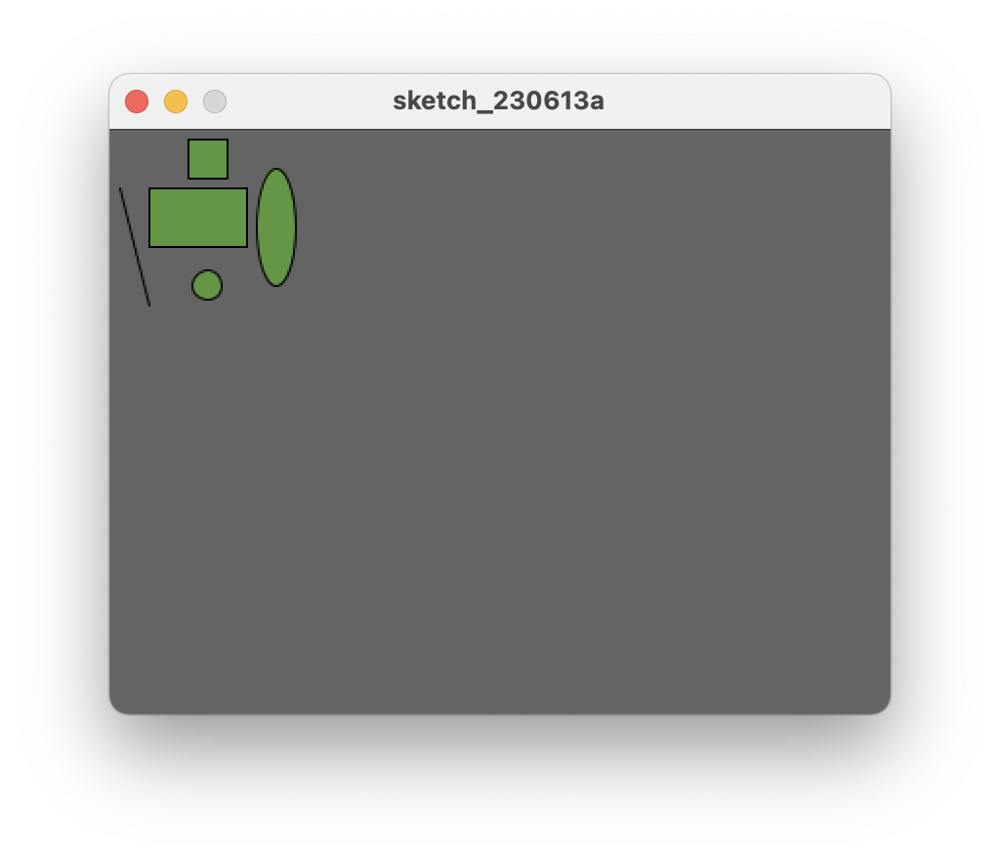
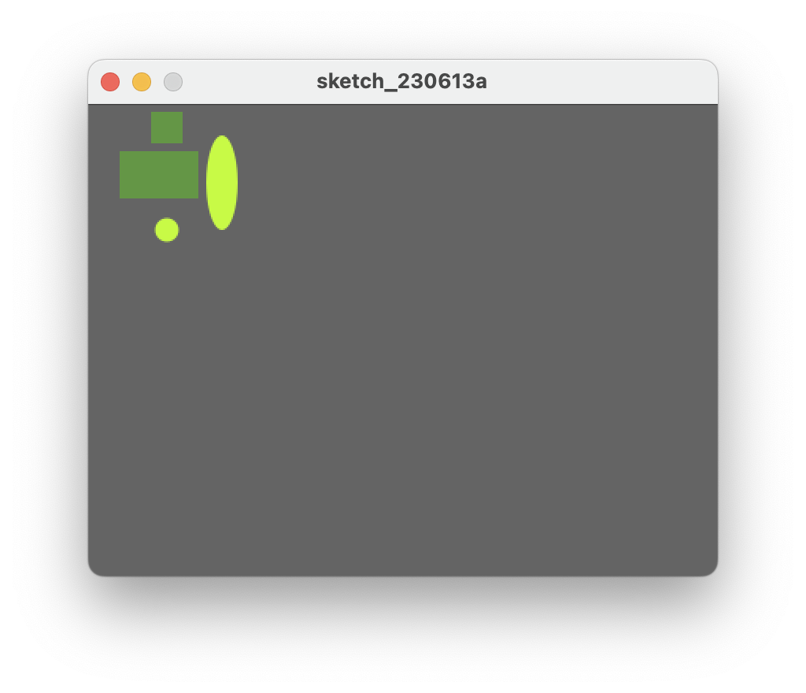

## Changing the look of the shapes

In this step, we will look at colouring in the shapes we have just drawn and also changing their outline.

### fill() function

The fill() function fills shapes with a chosen colour.  We will use the RGB colours to select a colour.  All shapes that are drawn after the **fill** function is called, will be filled with the chosen colour.  

The syntax of the RGB **fill** function is similar to the **background** function and is:

~~~
    fill(r,g,b)
        r = red colour (a whole number between 0 and 255 inclusive)
        g = green colour (a whole number between 0 and 255 inclusive)
        b = blue colour (a whole number between 0 and 255 inclusive)
~~~

In your open sketchbook, enter the following code just before you draw any shapes:

~~~java
    fill(100,150,70);
~~~

Run your code; all your shapes should be coloured dark green.

Now we will set the ellipses to be a different colour i.e. light green.  Enter the following code before your first ellipse() function call.

~~~java
    fill(200,250,70);
~~~

### Order of statements matter

Note how the order of statements matter.  All shapes drawn after the first fill() function is called are coloured dark green.  All shapes drawn after the second fill() function is called are coloured light green.

Try moving the first ellipse() function call **before** the second fill() function call.  What happened?  Only the second ellipse is coloured light green.   

Move the ellipse function back to it's original location so both ellipses are coloured light green.

### noStroke() function

A **stroke** is the outline of a shape.  The noStroke() function disables the outline on shapes that are drawn after the function is called.  

In your open sketchbook, enter the following code before your draw any shapes:

~~~java
    noStroke();
~~~

When you run your code, you should have something similar to this:

 

### stroke() function

The stroke() function enables the outline on shapes that are drawn after the function is called.  When you call stroke(), you need to specify a colour.

The syntax of the **stroke** function is also similar to the **fill** and **background** function and is:

~~~
    stroke(r,g,b)
        r = red colour (a whole number between 0 and 255 inclusive)
        g = green colour (a whole number between 0 and 255 inclusive)
        b = blue colour (a whole number between 0 and 255 inclusive)
~~~

If we wanted **all** shapes **except** the first ellipse (the oval) to have a stroke, you should make the following changes:

- remove the call to **noStroke()** that you just put into your code.
- call **noStroke()** before the first ellipse is drawn.
- call **stroke(0,0,0)** before the second ellipse is drawn to enable a black stroke on the second ellipse.

Your output should look similar to this:

### strokeWeight() function

The strokeWeight() function allows you to choose the thickness of a line/outline on shapes.  The chosen thickness will apply to all lines/shapes that are drawn after the function is called.  The thickness is specified in pixels and the default thickness is 1 pixel.

If we wanted **all** shapes to have thickness of 3 pixels, enter the following code before you draw any of the shapes:

~~~java
    strokeWeight(3);
~~~

Your output should look similar to this:

### Code so far

The code that produced the above screen shot is below.  You will be using this as a starting point for Exercise 1:

~~~java
size(400,300);
background(100); 

strokeWeight(3);

fill(100,150,70);
rect(20,30,50,30);
rect(40,5,20,20);
line(5,30,20,90);
fill(200,250,70);

noStroke();
ellipse(85,50,20,60);
stroke(0,0,0);
ellipse(50,80,15,15);
~~~

