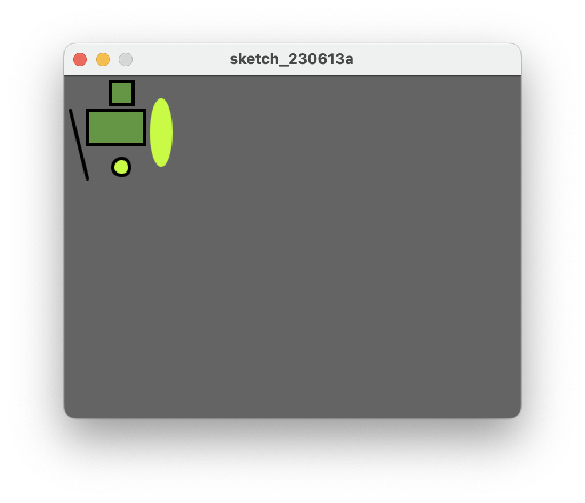
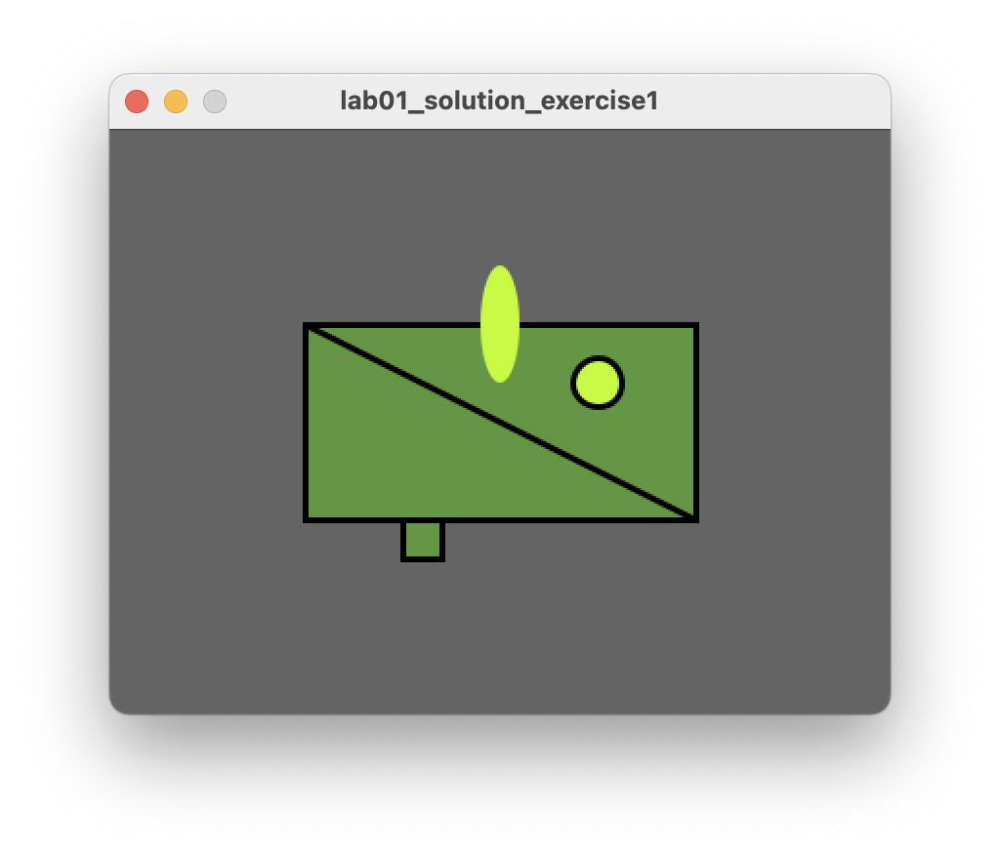
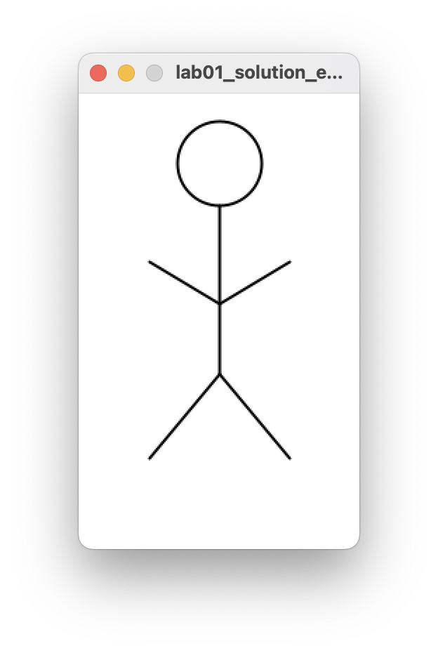
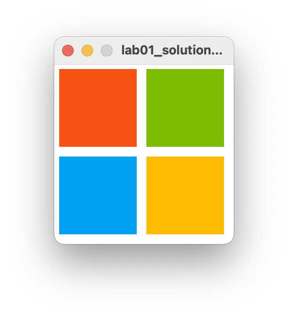
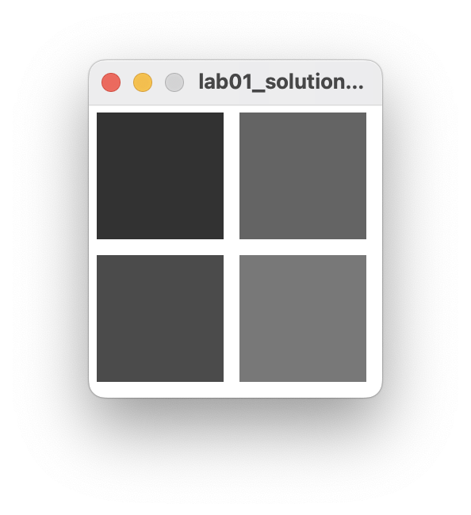

## Exercises

- These exercises are based on the functions we covered in the previous steps in this lab.

- For each exercise listed below, create a new sketchbook.

### Exercise 1

At the end of the previous step, your animation looked like this:

Make the necessary changes so your animation now looks like this image:

### Exercise 2

- Draw a stick man as shown in the picture below:
### Exercise 3

Replicate the basic Microsoft logo as shown in the picture below:

Hint:  You could use [this website](http://designpieces.com/2014/11/brand-colours/) to find the exact Microsoft RGB colours in their logo.

### Exercise 4

Convert the Microsoft logo into a grayscale logo as shown in the picture below:

Hint: the easiest way to do this is to use the grayscale **fill** function as opposed to the RBG version of it.  The grayscale version of **fill** takes one parameter, a number between 0 and 255 inclusive.  This numver represents a shade of gray between black (0) and white (255) e.g.:

~~~java
    fill(150);   //sets a medium gray colour for all shapes drawn after it
    fill(0);     //sets a black colour for all shapes drawn after it
    fill(255);   //sets a white colour for all shapes drawn after it
~~~ 

