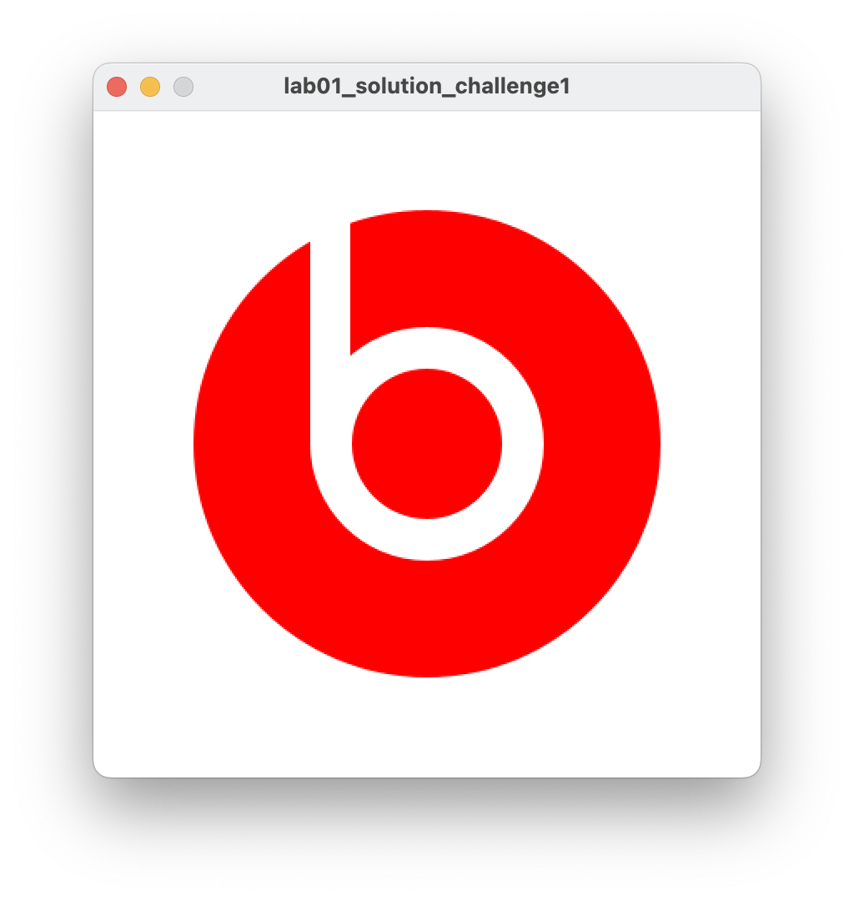
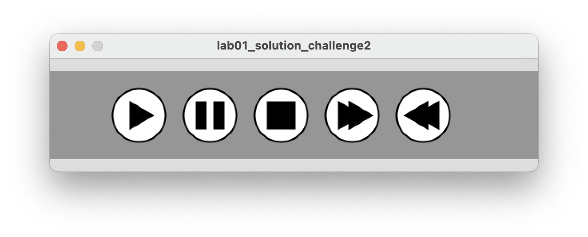

## Challenges

- For each challenge listed below, create a new sketch.

- In this module, the **Challenge Exercises** are exactly that...challenges!  So if you can't do them straight away (or at all), don't panic.  In most cases, they require additional thinking and research.  You may need to visit the [Processing website](https://processing.org/reference/) for additional information to attempt them.

- Note, the sequence that the shapes are drawn in these challenges matters!

### Challenge 1

Replicate the beats (Dr. Dre) logo as shown in the picture below:

### Challenge 2

Write the code that will draw the typical control buttons you would see on a media player.  An example image would be:

Hint: you will need to read up on the triangle() function on the [Processing website](https://processing.org/reference/triangle_.html).

### Challenge 3

Design your own picture, making sure to use combinations of Circles, Ovals, Squares, Rectangles and Lines.  

