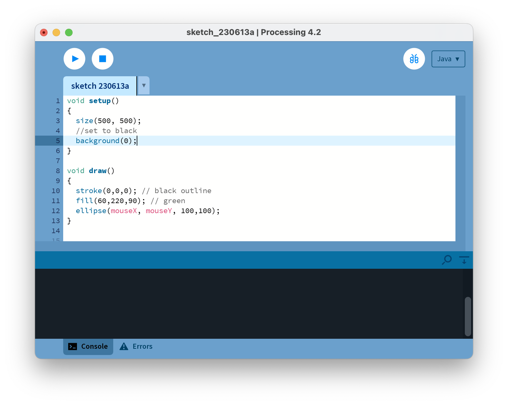
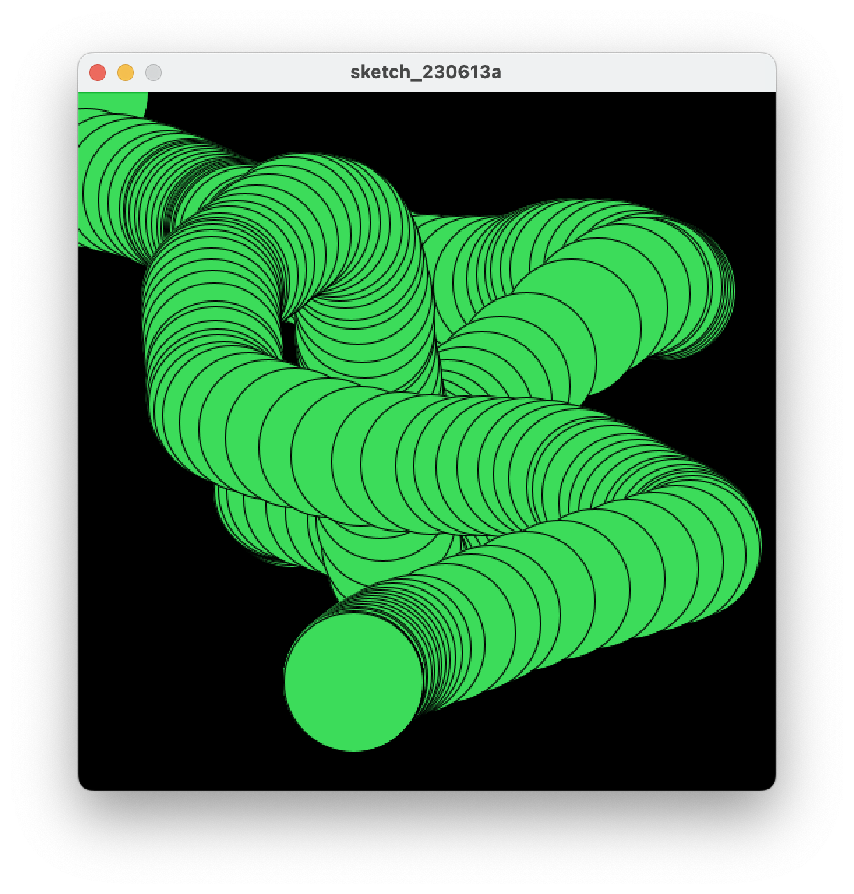

[BACK](/topics/topic02/lab02/01.html) [NEXT](/topics/topic02/lab02/03.html)

## Basic Animation

- We will use the following built-in functions to animate our drawings:
    - **setup()**
    - **draw()**
    
### A note on the **setup()** function

- setup() is called once when the program starts and should not be called again.
- setup() can set the screen size and background colour. 
- There can only be one setup() function for each sketch.

### A note on the **draw()** function

- You should never call the draw() function.
- Processing automatically calls the draw() function straight after the setup() call.
- draw() continuously executes the code contained inside it.
- There can only be one draw() function for each sketch.

### Animating Ellipses

In your PDE, enter the following code:

Using the **File**, **Save as...** menu options, save this sketchbook with the following naming convention:  *labXX_stepYY*, where *XX* is the number of the lab and *YY* is the number of the step.

Run the code.  As you move your mouse around the canvas, you should have animation similar to the screen shot below.

Can you explain why there are multiple circles drawn?  Why not just one circle? 

