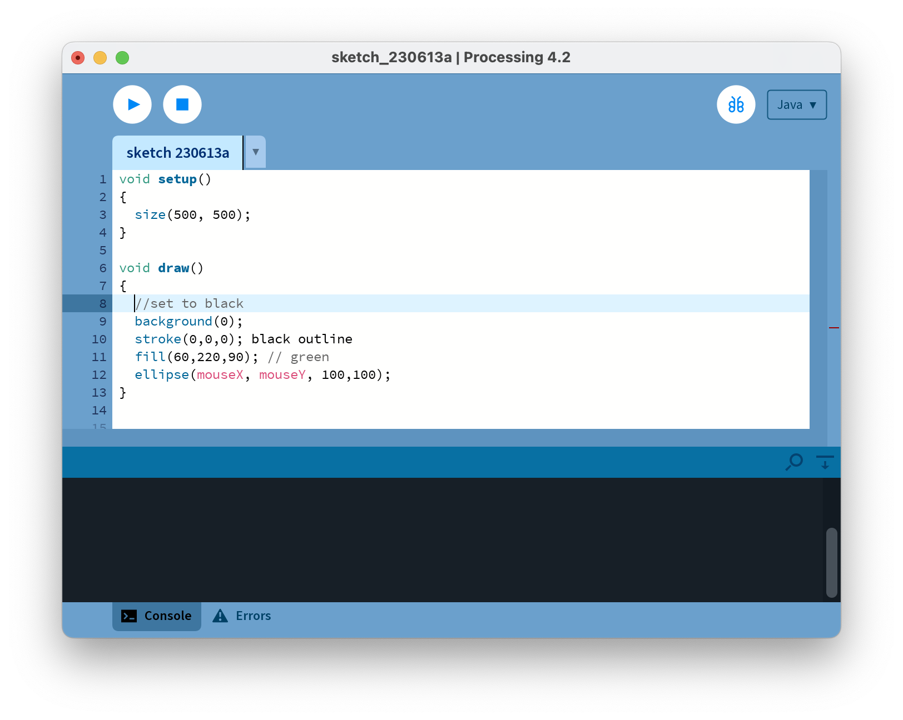
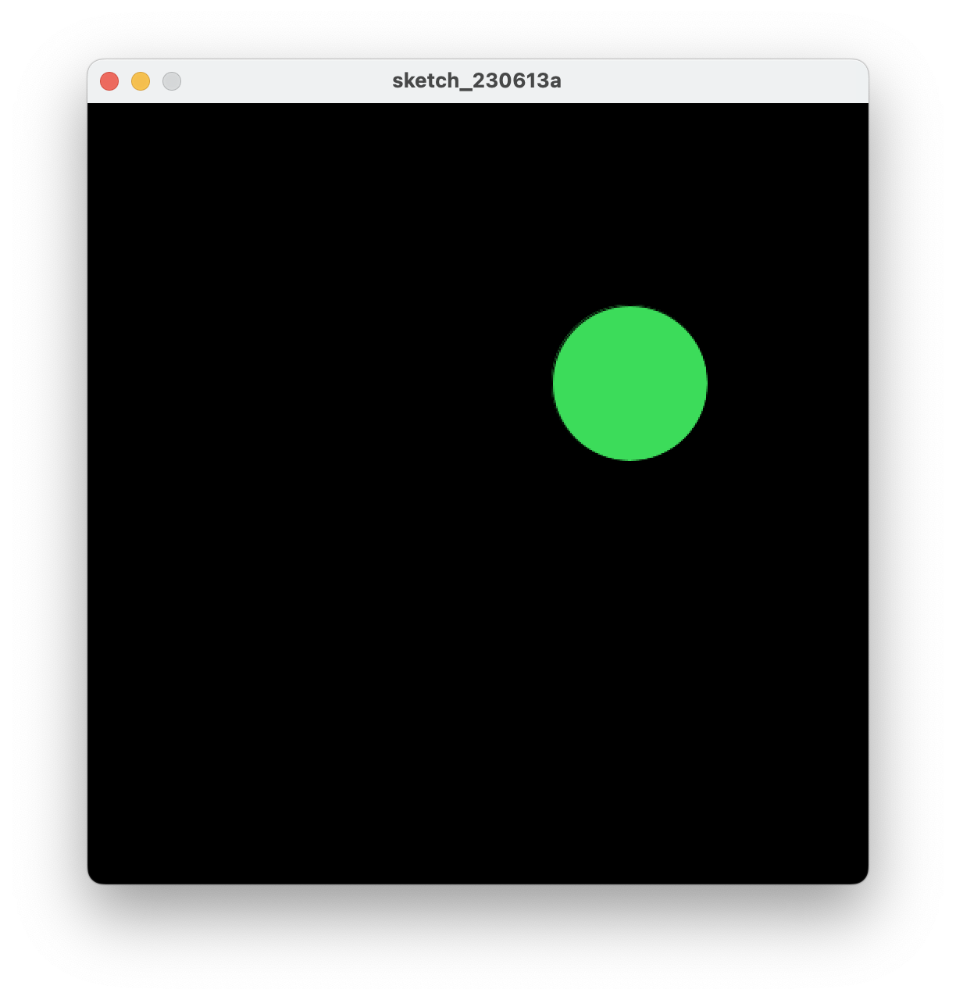

[BACK](/topics/topic02/02.html) [NEXT](/topics/topic02/lab02/04.html)

## Animating Ellipses (continued)

We are now going to change the code (from the previous step) so that only one circle is shown when you move the mouse.

Amend your code so that the background function is in the draw method instead of the setup method:

Run the code.  As you move the mouse over the canvas, you should have animation similar to the screen shot below.

Can you explain why there is only one circle drawn as we move our mouse? 

