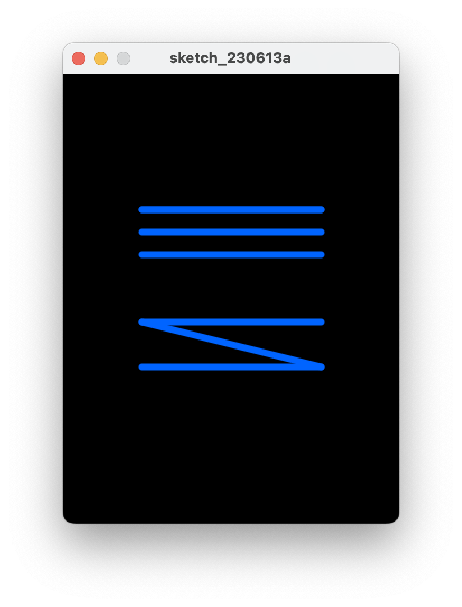

[BACK](/topics/topic02/04.html) [NEXT](/topics/topic02/lab02/06.html)

## Primitive Data Types

In Java, there are:

- four whole number data types:  byte, short, int, long.

- two decimal number data types: float (default in Processing) and double (default in Java apps).

- a single character data type: char.

- a true/false data type: boolean.

### Using the **int** data type

Create a new Sketchbook in your PDE and save it using the following naming convention:  *labXX_stepYY*, where *XX* is the number of the lab and *YY* is the number of the step.

Enter the following code:

Run the code.  Your window should now have three blue lines similar to the screen shot below:
Update the code using a, b and c variables to generate new lines:

Run the code.  Your window should now have three new blue lines similar to the screen shot below:

### A syntax error

Update the code by changing **int** to **Int** (uppercase I).  Run your code again.  What happened? Can you explain what happened?  Ask your lecturer to explain it if you are not sure. 

Change **Int** back to **int**.

### Another syntax error

Update the code by changing the amount assigned to variable **a** from 70 to 70.56.  

Run your code again.  What happened? Can you explain what happened?  Ask your lecturer to explain it if you are not sure. 

Change 70.56 back to 70.

Save and close the sketchbook.

