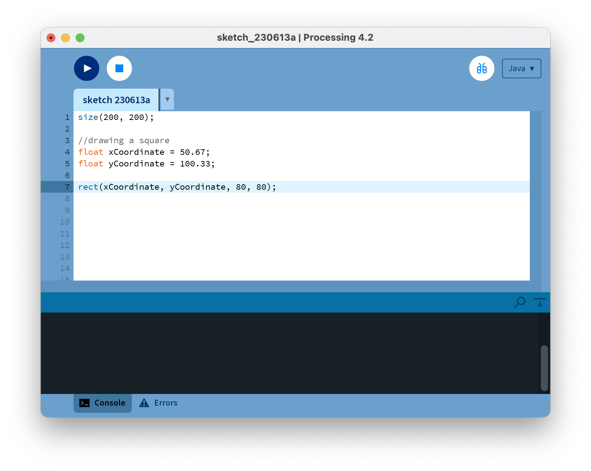
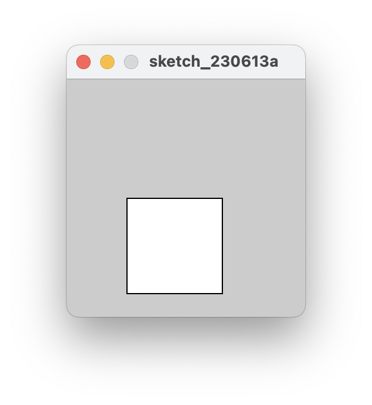

[BACK](/topics/topic02/05.html) [NEXT](/topics/topic02/lab02/07.html)

## Primitive Data Types

### Using the float data type

Create a new Sketchbook in your PDE and save it using the following naming convention:  *labXX_stepYY*, where *XX* is the number of the lab and *YY* is the number of the step.

Enter the following code:

Run the code.  You should see a grey window with a white square drawn in it.

### Not a syntax error!

Update the code by changing the amount assigned to the xCoordinate variable from 50.67 to just 50.

Run the code.  Why did it work? Can you explain what happened?  Ask your lecturer to explain it if you are not sure. 

Change the amount assigned to the xCoordinate variable back to 50.67.

### A syntax error

Update the code by changing **float** to **double**.  

You have a syntax error.  Can you explain why?  Ask your lecturer to explain it if you are not sure. 

Change **double** back to **float**.

### Another syntax error

Update the code by renaming the **yCoordinate** variable name to **xCoordinate**, as shown below:

~~~java
float xCoordinate = 50.67;
float xCoordinate = 100.33;
rect(xCoordinate, yCoordinate, 80,80);
~~~

You have a syntax error...can you explain why?  Ask your lecturer to explain it if you are not sure. 

Change the code back.

Save and close the sketchbook.

	