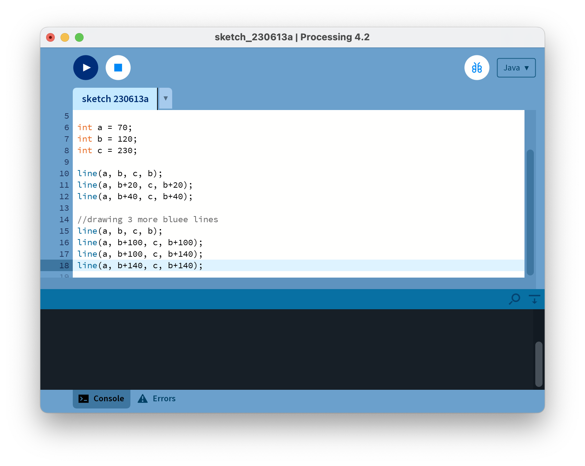
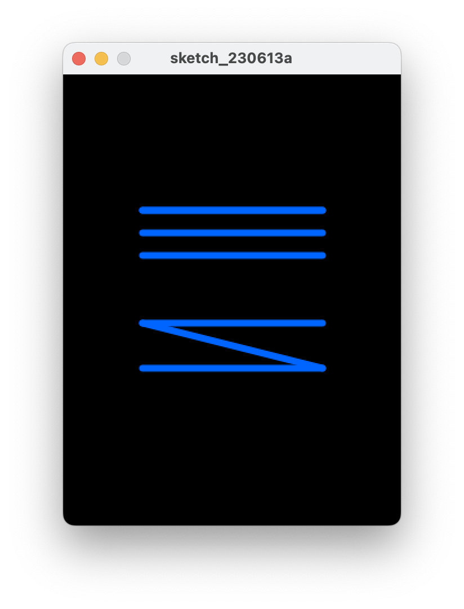
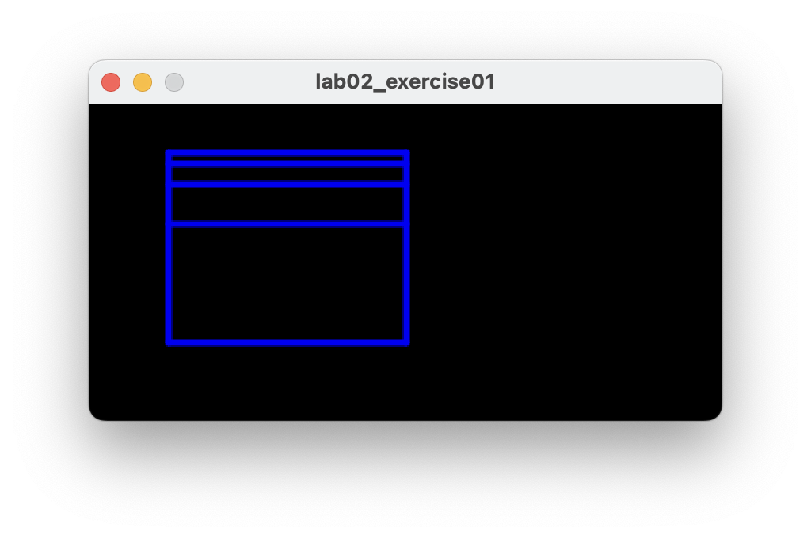
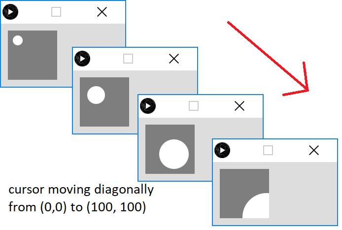
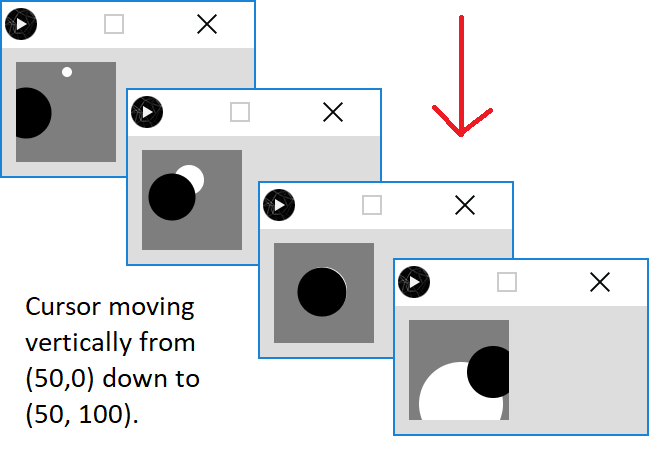

[BACK](/topics/topic02/06.html) [NEXT](/topics/topic02/lab02/08.html)

## Exercises

The exercises are typically based on the material we covered in the previous steps in this lab and the associated lectures.

For each exercise listed below, open a new sketch.

### Exercise 1 (static drawing)

In Step04 we entered this code:

Which produced this output:

Using this code as a starting point, make the following changes so that your output looks like this:

**NOTE**: the object of this exercise is to use the arithmetic operators on the variables (a,b,c).

### Exercise 2 (static drawing)

The object of this exercise is to produce the same output as Exercise 1, but instead of using variables (a,b,c) use the **width** and **height** system variables and perform arithmetic calculations on them to produce the desired output.

### Exercise 3 (animated drawing)

Produce the following animation:

- a white circle is drawn when you move the mouse; only one circle is visible at one time (i.e. all previous ones are cleared).

- the x and y coordinates for the circle are dependent on the mouse position (hint: use system variables mouseX and mouseY).

- the size of the circle is determined by the y mouse coordinate.

When you run your code, your circle should grow in size as you move your mouse pointer down the window and reduce in size when you move your mouse up the window.  When you move your mouse horizontally, the circle should stay the same size.  

### Exercise 4 (animated drawing)

Using exercise 3 as a starting point (i.e. keeping the white circle functionality), add the following black circle animation to it:

- a black circle is drawn when you move the mouse (all previous black circles are cleared).

- the x coordinate for the black circle is the mouseY coordinate and the y coordinate for the circle is mouseX.

- the size of the circle is determined by the x mouse coordinate.

When you run your code, the black circle should overlap the white circle when you drag your mouse from (0,0) diagonally down to (100,100).  When you move your mouse horizontally, the black circle show grow/shrink in size.  It remains the same size when the mouse is dragged vertically.  Note that the white circle's behaviour hasn't changed.

