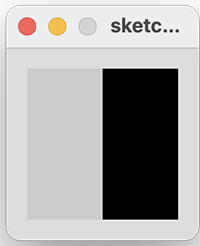

[BACK](/topics/topic03/lab03/00.html) [NEXT](/topics/topic03/lab03/02.html)

## Conditional Example 3.1

In this step, we will implement an example from your lecture.

If the x coordinate of the mouse pointer is on the:

- left half of the display window, draw a rectangle on the left hand side.  

- right half of the display window, draw a rectangle on the right hand side.

|         |            |  |
| :-------------: |:-------------:| :-----:|
|    |   |  |
|   |       |    |
|    |  |     |

### Conditional Example 3.1

Create a new Processing sketch in your workspace and call it **Example\_3\_1**.

Enter the following code into your sketchbook (avoid the temptation to copy and paste it...you learn more by writing the code out):

~~~java
void setup() {
    size(100, 100);
    noStroke();
    fill(0);
}

void draw() {
    background(204);
    if (mouseX < 50) 
    {
       rect(0, 0, 50, 100); 
    } 
    else 
    {
       rect(50, 0, 50, 100); 
    }
}
~~~

- Run your code.  Does it work as you would expect?
