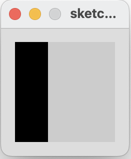
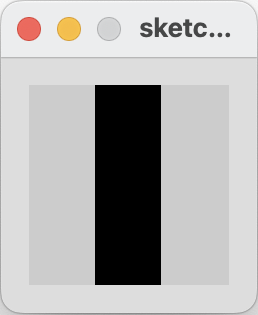
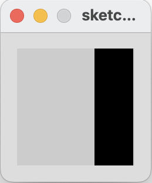

[BACK](/topics/topic03/lab03/01.html) [NEXT](/topics/topic03/lab03/03.html)

## Conditional Example 3.2

In this step, we will implement an example from your lecture.

If the x coordinate of the mouse pointer is on the:

- left third of the display window, draw a rectangle on the left third of the window.  

- middle third of the display window, draw a rectangle on the middle third of the window.

- right third of the display window, draw a rectangle on the right third of the window.

|         |            |  |
| :-------------: |:-------------:| :-----:|
|    |   |  |
|   |       |    |
|    |  |     |

### Conditional Example 3.2

Create a new Processing sketch in your workspace and call it **Example\_3\_2**.

Enter the following code into your sketchbook (avoid the temptation to copy and paste it...you learn more by writing the code out):

~~~java
void setup() {
    size(100, 100);
    noStroke();
    fill(0);
}

void draw() {
    background(204);
    if (mouseX < 33) {
        rect(0, 0, 33, 100); 
    } 
    else if (mouseX < 66) {
        rect(33, 0, 33, 100); 
    } 
    else {
         rect(66, 0, 33, 100); 
    }  
}

~~~

- Run your code.  Does it work as you would expect?

