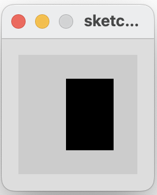
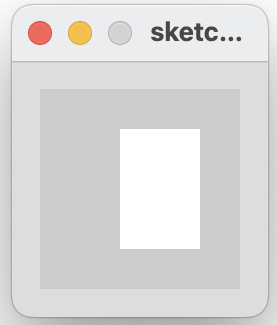

## Conditional Example 3.3

In this step, we will implement an example from your lecture.

If the mouse pointer is:

- inside the rectangle coordinates, then fill the rectangle with white.

- otherwise, fill with black.

|         |            |  |
| :-------------: |:-------------:| :-----:|
|    |   |  |
|   |       |    |
|    |  |     |

### Conditional Example 3.3

Create a new Processing sketch in your workspace and call it **Example\_3\_3**.

Enter the following code into your sketchbook (avoid the temptation to copy and paste it...you learn more by writing the code out):

~~~java
void setup() {
  size(100, 100);
  noStroke();
  fill(0);
}

void draw() {
  background(204);
  if ((mouseX > 40) && (mouseX < 80) &&
      (mouseY > 20) && (mouseY < 80)) {
      fill(255);
  } else {
      fill(0);
  }
  rect(40, 20, 40, 60);
}
~~~

- Run your code.  Does it work as you would expect?

