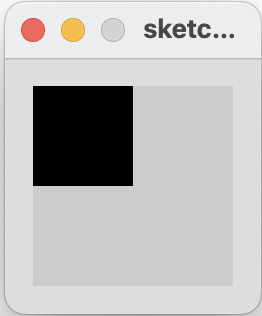

## Conditional Example 3.4

In this step, we will implement an example from your lecture.

- If the mouse pointer is in the upper-left quadrant of the display window, draw a black rectangle covering the upper-left quadrant of the window.  

- Repeat this approach for upper-right, lower-left and lower-right quadrants. 

|         |            |  |
| :-------------: |:-------------:| :-----:|
|    |   |  |
|   |       |    |
|    |  |     |

### Conditional Example 3.4

Create a new Processing sketch in your workspace and call it **Example\_3\_4**.

Enter the following code into your sketchbook (avoid the temptation to copy and paste it...you learn more by writing the code out):

~~~java
void setup() {
  size(100, 100);
  noStroke();
  fill(0);
}

void draw() {
  background(204);
  if ((mouseX <= 50) && (mouseY <= 50)) {
    rect(0, 0, 50, 50);             // upper-left
  } else if ((mouseX <= 50) && (mouseY > 50)) {
    rect(0, 50, 50, 50);            // lower-left
  } else if ((mouseX > 50) && (mouseY <= 50)) {
    rect(50, 0, 50, 50);            // upper-right
  } else {
    rect(50, 50, 50, 50);           // lower-right
  }
}
~~~

- Run your code.  Does it work as you would expect?

