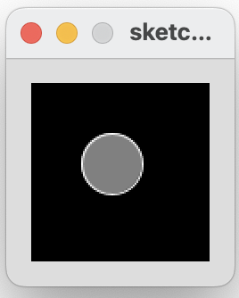
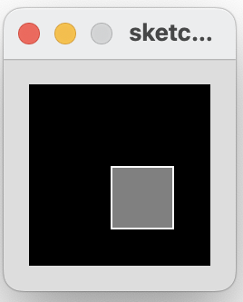

[BACK](/topics/topic03/lab03/04.html) [NEXT](/topics/topic03/lab03/06.html)

## Mouse Example 3.5

In this step, we will implement an example from your lecture.

If the mouse is pressed:

- draw a gray square with a white outline.  

- otherwise draw a gray circle with a white outline.

|         |            |  |
| :-------------: |:-------------:| :-----:|
|    |   |  |
|   |       |    |
|    |  |     |

### Mouse Example 3.5

Create a new Processing sketch in your workspace and call it **Example\_3\_5**.

Enter the following code into your sketchbook (avoid the temptation to copy and paste it...you learn more by writing the code out):

~~~java
void setup() {
  size(100,100);
}

void draw() {
   background(0);
   stroke(255);
   fill(128);
   if (mousePressed){
       rect(45,45,34,34); 
   }
   else{
       ellipse(45,45,34,34);     
   }
}
~~~

- Run your code.  Does it work as you would expect?

