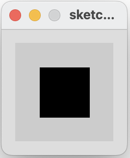
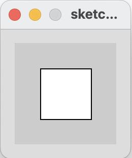

## Mouse Example 3.6

In this step, we will implement an example from your lecture.

If the mouse is pressed:

- set the fill to white and draw a square.

- otherwise set the fill to black and draw a square.

|         |            |  |
| :-------------: |:-------------:| :-----:|
|    |   |  |
|   |       |    |
|    |  |     |

### Mouse Example 3.6

Create a new Processing sketch in your workspace and call it **Example\_3\_6**.

Enter the following code into your sketchbook (avoid the temptation to copy and paste it...you learn more by writing the code out):

~~~java
void setup() {
  size(100,100);
}

void draw() {
  background(204);
  if (mousePressed == true)    
  {
       fill(255); // white
   } else {
       fill(0);     // black
   }
   rect(25, 25, 50, 50);
}
~~~

- Run your code.  Does it work as you would expect?

