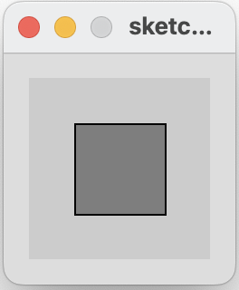
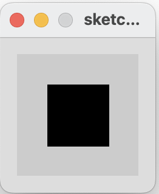
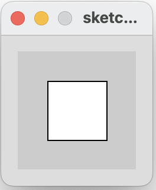

[BACK](/topics/topic03/lab03/06.html) [NEXT](/topics/topic03/lab03/08.html)

## Mouse Example 3.7

In this step, we will implement an example from your lecture.

- If the LEFT button on the mouse is pressed, set the fill to black and draw a square.  As soon as the LEFT button is released, gray fill the square.

- If the RIGHT button on the mouse is pressed, set the fill to white and draw a square. As soon as the  RIGHT button is released, gray fill the square.

- If no mouse button is pressed, set the fill to gray and draw a square.

|         |            |  |
| :-------------: |:-------------:| :-----:|
|    |   |  |
|   |       |    |
|    |  |     |

### Mouse Example 3.7

Create a new Processing sketch in your workspace and call it **Example\_3\_7**.

Enter the following code into your sketchbook (avoid the temptation to copy and paste it...you learn more by writing the code out):

~~~java
void setup() {
  size(100,100);
}

void draw() { 
   if (mousePressed){
       if (mouseButton == LEFT) 
            fill(0);      // black
       else if (mouseButton == RIGHT)
            fill(255);    // white
   }        
   else { 
       fill(126);     // gray
    }
    rect(25, 25, 50, 50);
}
~~~

- Run your code.  Does it work as you would expect?

