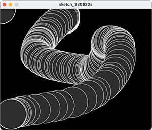
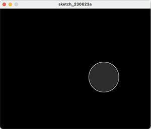

## Mouse Example 3.8

In this step, we will implement an example from your lecture.

- Draw a circle on the mouse (x,y) coordinates.

- Each time you move the mouse, draw a new circle.

- All the circles remain in the sketch until you press a mouse button.

- When you press a mouse button, the sketch is cleared and a single circle is drawn at the mouse (x,y) coordinates.

|         |            |  |
| :-------------: |:-------------:| :-----:|
|    |   |  |
|   |       |    |
|    |  |     |

### Mouse Example 3.8

Create a new Processing sketch in your workspace and call it **Example\_3\_8**.

Enter the following code into your sketchbook (avoid the temptation to copy and paste it...you learn more by writing the code out):

~~~java
void setup() {
  size(500,400);
  background(0);
}

void draw() {
 
  if (mousePressed) {
    background(0);
  }

  stroke(255);
  fill(45,45,45);
  ellipse(mouseX, mouseY, 100, 100);
}
~~~

- Run your code.  Does it work as you would expect?

