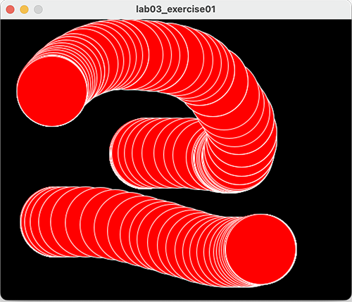
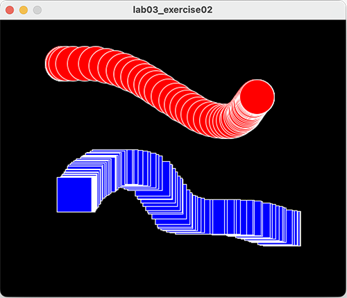
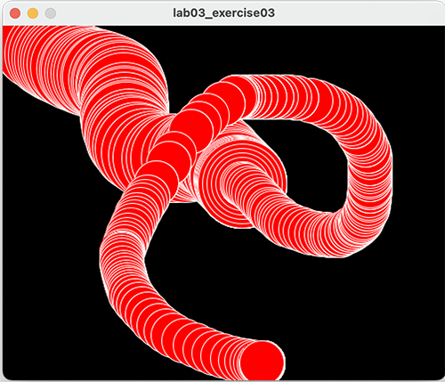
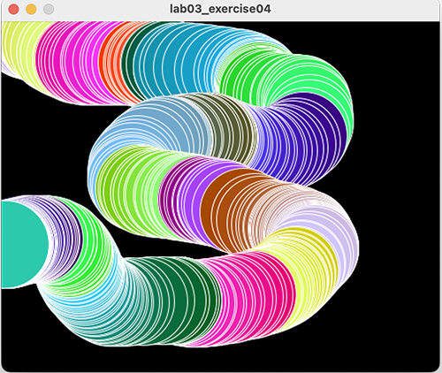

## Exercises

- For each exercise listed below, create a new sketch.

- You may need to visit the [Processing website](https://processing.org/reference/) for additional information.

### Exercise 1

- Create a display window of 500x400, with a black background.

- When the mouse is pressed, draw a red circle (100 pixel diameter) with a white outline.  

- Note:  when the mouse is pressed and dragged, multiple circles should be drawn.  When the mouse is released and moved, no circles should be drawn.

### Exercise 2

- Create a display window of 500x400, with a black background.

- When the LEFT mouse button is pressed, draw a red circle (50 pixel diameter) with a white outline.  Note:  when this button is pressed and dragged, multiple circles should be drawn.

- When the RIGHT mouse button is pressed, draw a blue square (length of 50 pixels) with a white outline.  Note:  when this button is pressed and dragged, multiple squares should be drawn.

- When no button is pressed and the mouse is dragged, nothing should be drawn.

### Exercise 3

- Draw circles (diameter 100) as the mouse is moved (the background should not be cleared).

- When the mouse is pressed, reduce the size of the circle by 10 pixels.  

- When the circle diameter reaches 50 pixels, don't reduce it anymore.

### Exercise 4

- Draw circles (diameter 100) as the mouse is moved (the background should not be cleared).

- As each circle is drawn, its colour should vary from the previous one (use mathematical calculations on your RBG colours).
 
- Make sure you **boundary** test this exercise.  What we mean by that is...test what happens when your colour reaches 0 or when it reaches 255.  Does it reset itself and cycle through the colours again or does it get stuck drawing in only one colour?

