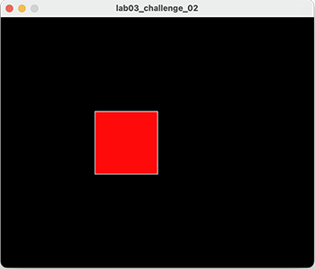

## Challenges

- For each challenge listed below, create a new sketch.

- You may need to visit the [Processing website](https://processing.org/reference/) for additional information.

### Challenge 1

- Draw a continuously bouncing ball.  

- For the moment, the xCoordiate should remain the same value i.e. the ball only bounces vertically, so it is only the yCoordiate that needs to change.

|         |            |  | |  |
| :-------------: |:-------------:| :-----:|:-------------: |:-------------:|
|    |   |  ||  |
|   |       |    |  |  |
|    |  |     ||     |

### Challenge 2

- Visit the [Processing website](https://processing.org/reference/) and read up on the following keyEvents:

    - keyPressed (boolean variable used to determine if a key was pressed).
    - key (which stores a single alphanumeric character i.e. the most recently pressed key).

- In a new sketch, draw a cirlce if the **C** key was pressed and a rectangle if any other key was pressed.

- Test your code...is the keyboard input case sensitive? Can you enter a lower case **c** to draw a circle?

|         |            |  |
| :-------------: |:-------------:| :-----:|
|    |   |  |
|   |       |    |
|  **Any** Key Pressed  | **C** Key Pressed |     |

### Challenge 3

- In a new sketch, draw a vertical line that is the height of your display window.

- This vertical line should start in the left most position of your display window and move right, pixel by pixel, until it reaches the right hand side of your display window.  

- Upon reaching the right hand side, the vertical line should reverse direction and return, pixel by pixel, to the left hand side of the display window.

- As your vertical line is continually traversing the display window, your grayscale background should be varying very slightly in colour.  

|         |            |  | |  |
| :-------------: |:-------------:| :-----:|:-------------: |:-------------:|
|    |   |  ||  |
| |||||
|    |  |     ||     |

