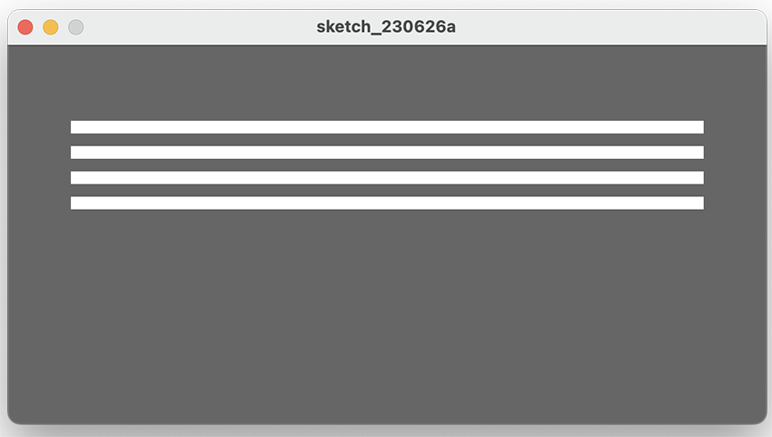
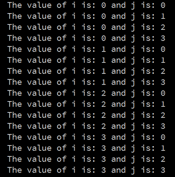

[BACK](/topics/topic04/lab04/02.html) [NEXT](/topics/topic04/lab04/04.html)

## For loops

In this step, we will implement the for loop examples 4.7 & 4.8 from your lectures.

### Convert a while loop to a for loop

Create a new Processing sketch in your workspace and call it **Example\_4\_7**.

The following code uses a while loop to draw four rectangles.  Rewrite it so that it uses a for loop instead:

~~~java
int yCoordinate = 60;

size(600, 300);
background(102);
fill(255);
noStroke();

int i = 0;
while (i < 4 ) 
{
    rect(50, yCoordinate, 500, 10);
    yCoordinate += 20;
    i++;
}
~~~

Run your code.  Does it work as you would expect?

Save your work. 

### Remove the **yCoordinate** variable.

In the above sketch, do a **Save as...** and give it the name **Example\_4\_8**. 

Now that you have the for loop working correctly, change (called refactoring in programming) the code so that it no longer has the variable **yCoordinate**.  Update the  loop to ensure that the **yCoordinate** functionality is not lost. 

Save your work.

### Rewriting the while nested loop

Create a new Processing sketch in your workspace and call it **lab04_step03**.

Refactor the code below (a nested loop using *while*) to be a nested loop using the *for* loop.

~~~java
int i = 0;
while ( i < 4 ) {
	 int j = 0;
     while (j < 4 ) {
        println("The value of i is: " + i + " and j is: " + j);
        j++;
        }
     i++;
     }
~~~

Run your code.  Does it work as you would expect?

