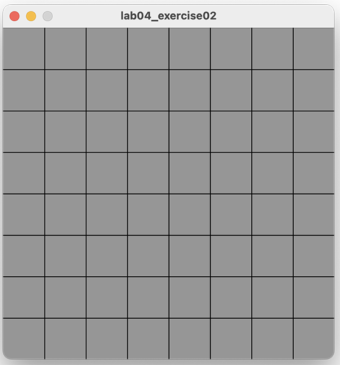
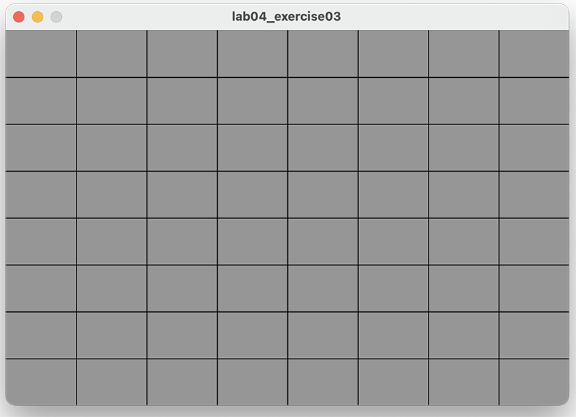

[BACK](/topics/topic04/lab04/03.html) [NEXT](/topics/topic04/lab04/05.html)

## Exercises

- For each exercise listed below, create a new sketch.

- You may need to visit the [Processing website](https://processing.org/reference/) for additional information.

### Exercise 1 (static drawing)

Create a display window of 400x400 with a grey background.

In the setup() method, use a **for** loop to draw a chessboard (for this exercise, use the line() method).

A chess board is an 8x8 grid and should look like the screen shot below:

### Exercise 2 (static drawing)

Create a new sketch and re-write the Exercise 1 code to use **while** loops instead of for loops.

### Exercise 3 (static drawing)

Create a new sketch and re-write the **Exercise 1** code so that the chess board is drawn correctly regardless of the width and height of the display window.

### Console Exercise 1

Create a new sketch and use a **while** loop and the println method to print hello 5 times to the console.  

When you have it working using the while loop, refactor your code to use a **for** loop.

### Console Exercise 2

Create a new sketch and use a **for** loop and the println method to print the numbers 1 to 10 to the console.  

When you have it working using the for loop, refactor your code to use a **while** loop.

### Console Exercise 3

Create a new sketch and use a **while** loop and the println method to print **10, 9, 8, 7, 6, 5, 4, 3, 2, 1, blast off** to the console.  

When you have it working using the while loop, refactor your code to use a **for** loop.

### Console Exercise 4

Create a new sketch and use a **for** loop and the println method to print all the even numbers between 2 and 10 to the console.  

When you have it working using the for loop, refactor your code to use a **while** loop.

