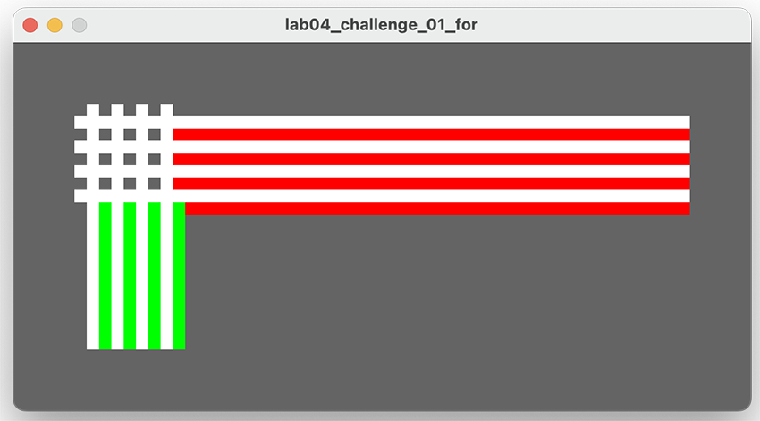
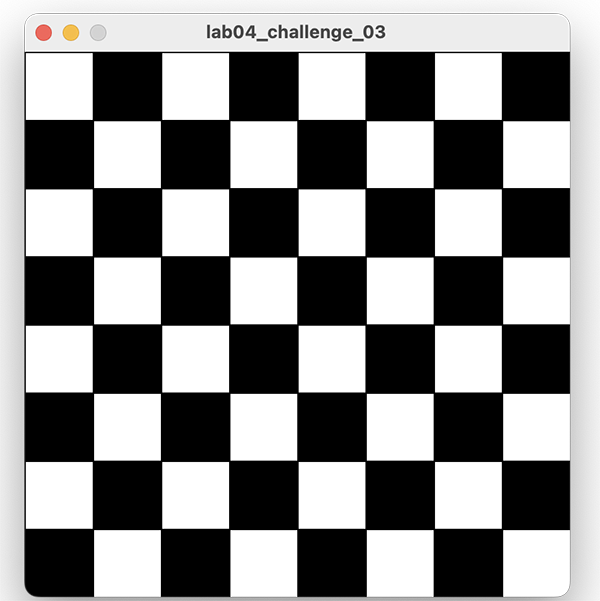

## Challenges

- For each exercise listed below, create a new sketch.

- You may need to visit the [Processing website](https://processing.org/reference/) for additional information.

### Challenge  1 (static drawing)

Create a new sketch and, using two **while** loops, draw this image:

When you have it working using while loops, convert the code to use **for** loops.

### Challenge 2 (static drawing)

Create a new sketch and draw a chessboard (like the ones from exercise 1) on a 400x400 window using the rect() method instead of the line() method.  You will need a nested **for** loop to do this.

### Challenge 3 (static drawing)

Create a new sketch and using the code from Challenge Exercise 2, try to colour every subsequent square in a darker colour, as shown in the image below:

Note:  You will need to read up on the modulo (%) operator in order to do this exercise.  This is quite a difficult exercise, so don't worry if you can't get it working.

