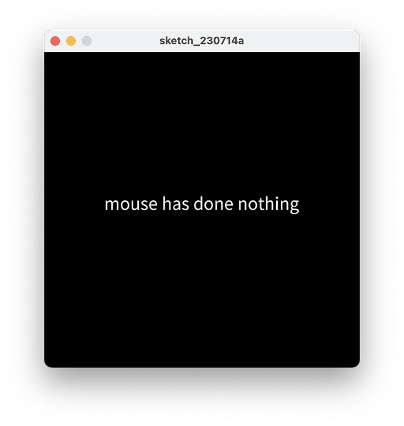
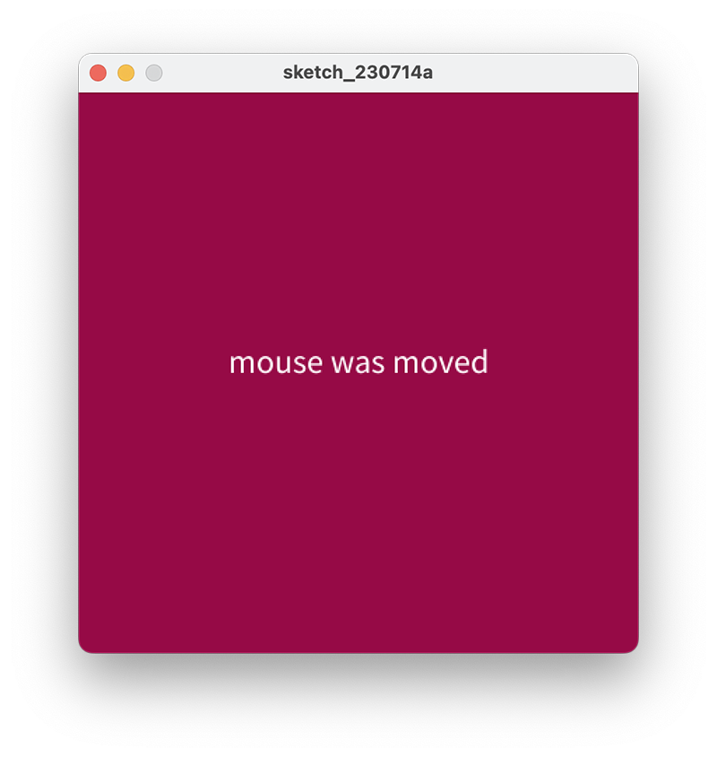
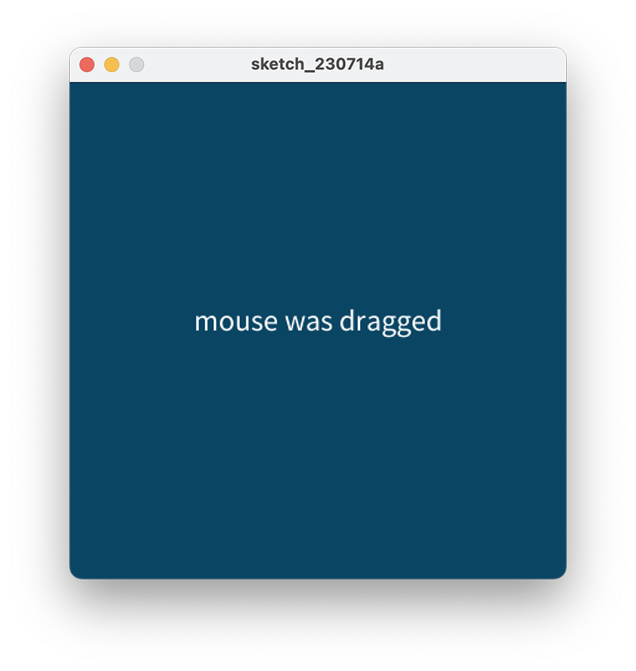
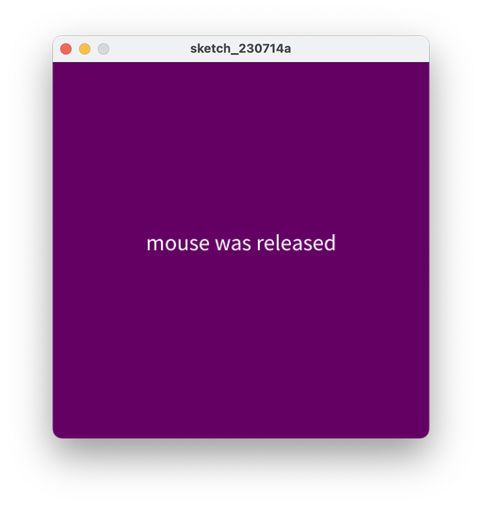
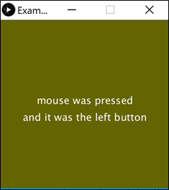

# Understanding mouse event methods

In this step, you will work on the processing example 5.1 from your lectures.

## Coding the setup() method

Create a new Processing sketch and call it **Example\_5\_1**.

Enter the following code into your sketchbook (don't cut and paste it):

~~~java
void setup() 
{
    size(400, 400);
    background(0);
    textAlign(CENTER);
    textSize(24);
    fill(255);
    text("mouse has done nothing", width/2, height/2);
}
~~~

Run the code. 

You have used a few new methods relating to **text**.  Navigate to the references section of the processing website and read about these methods.

If you are still not fully sure what a particular method is doing, change the actual parameters for it and see the effect on your sketch.  When finished, change the parameter back to the original value. 

## Coding the draw() method

Mouse and keyboard events only work when a program has draw().

Without draw(), the code is only run once and then stops listening for events.

In your open sketch, add the draw() method to it.  The body of the method should be empty.

##Coding the mouseMoved() method

Add a mouseMoved method that will change the background to a red colour.

Print the following text to the display window (not the console):

- "mouse was moved"

Run your code.  Does it work as you would expect when you move the mouse?

Note: the code for this method is here:

~~~java
void mouseMoved() 
{ 
    background(150, 10, 70); 
    text("mouse was moved", width/2, height/2); 
}
~~~

## Coding the mouseDragged() method

Add a mouseDragged method that will change the background to a blue colour.

Print the following text to the display window (not the console):

- "mouse was dragged"

Run your code.  Does it work as you would expect when you drag the mouse?

Note: the code for this method is here:

~~~java
void mouseDragged() 
{ 
    background(10, 70, 100); 
    text("mouse was dragged", width/2, height/2); 
}
~~~

## Coding the mouseReleased() method

Add a mouseReleased method that will change the background to a purple colour.

Print the following text to the display window (not the console):

- "mouse was released"

Run your code.  Does it work as you would expect when you release the mouse?

Note: the code for this method is here:

~~~java
void mouseReleased() 
{ 
    background(100, 0, 100); 
    text("mouse was released", width/2, height/2); 
}
~~~

## Coding the mousePressed() method

Add a mousePressed method that will change the background to a green colour.

Print the following text to the display window (not the console) when the left button was pressed:

- "mouse was pressed and it was the left button"

Print the following text to the display window (not the console) when the right button was pressed:

- "mouse was pressed and it was the right button"

Run your code.  Does it work as you would expect when you press the left and then the right mouse buttons?

Note: the code for this method is here:

~~~java
void mousePressed() 
{
    background(100, 100, 0);
    text("mouse was pressed", width/2, height/2);
    if ( mouseButton == LEFT) 
    {
        text("and it was the left button", width/2, height/2 + 40);
    }
    if (mouseButton == RIGHT) 
    {
        text("and it was the right button", width/2, height/2 + 40);
    }
}
~~~

