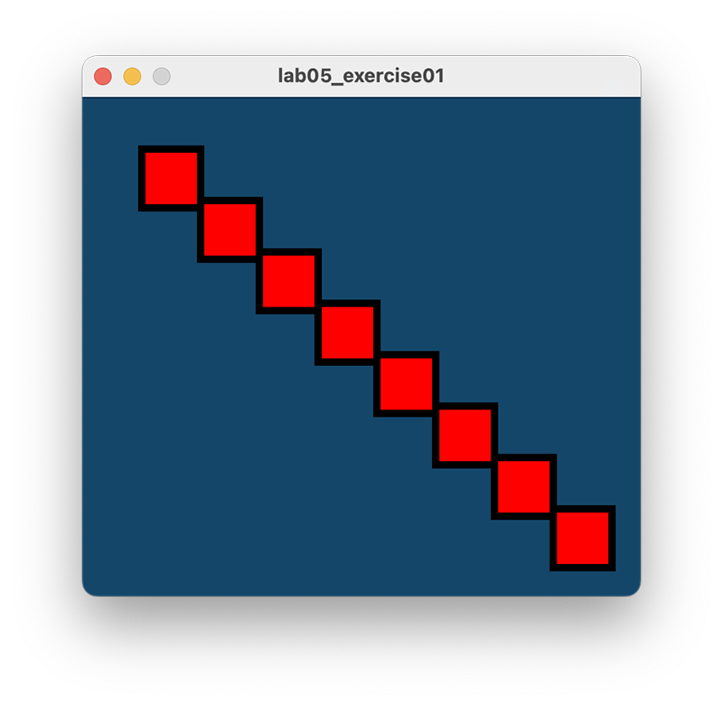
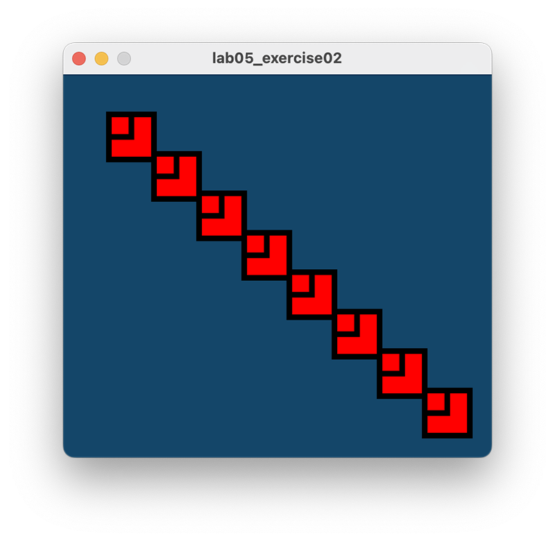

# Exercises

- For each exercise listed below, create a new sketch.

- You may need to visit the [Processing website](https://processing.org/reference/) for additional information.

## Exercise 1

The object of this exercise is to refactor the **Example 5.5** code to add a new parameter to the drawRedSquare method.  This new parameter will set the stroke of the square.  

We will also change the size of the window and the size of the square in this exercise.  

The expected output will be:

First, change the size of the display window to (380,340).  When you run the code, you will see that the squares are not evenly distributed throughout the window.  Make the changes so that the squares are laid out like the above image.  

Second, amend the drawRedSquare method so that a stroke value is passed as a parameter. Set the stroke to 5.

Run your code...it should look like the above screenshot. 

## Exercise 2

Using the solution to Exercise 1, try produce this output:
Note that you can achieve this with just one extra line of code!
