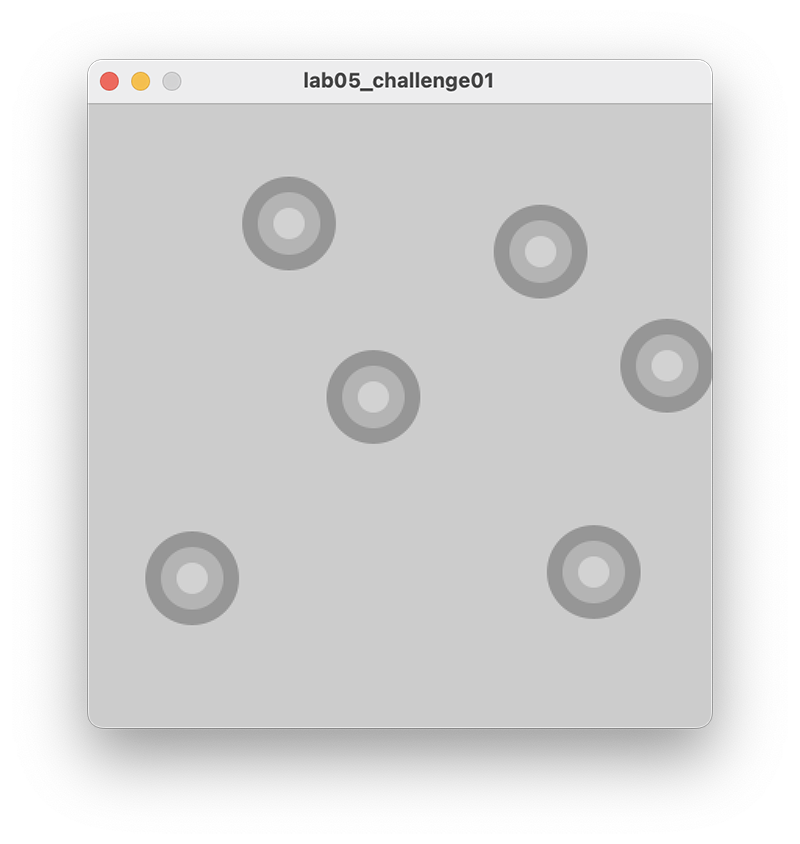

[BACK](/topics/topic05/lab05/05.html) [NEXT](/topics/topic05/lab05/07.html)

# Challenges 

- You may need to visit the [Processing website](https://processing.org/reference/) for additional information.

## Challenge 1

Create a new sketch called **lab05\_Challenge01**.

Enter the following starting code into your sketch (you shouldn't need to make any changes to these methods for this challenge):

~~~java
void setup()
{
  size(400,400);
  noStroke();
}

void draw()
{
}
~~~

Write a **`mousePressed`** method that has one line of code in it.  This line of code should be a call to the **`drawTarget`** method (you will write this next), passing the values *3* and *150* as actual parameters.

Now for the challenge...write a method called **`drawTarget`** that returns no data, but takes two paramters of type `int`.  

- The first parameter represents the number of circles in the target i.e. **size**.  

- The second parameter represents the starting grayscale colour i.e. **gray**

The only code in this method is a for loop.  The loop will execute enough times to draw the number of circles required (determined by **size**).  

- This loop should set the fill to the value of **gray**.

- Draw an ellipse at the current mouse coordinates with a diameter starting at 20 and increasing by 20 for each subsequent ellipse drawn.

- Increase **gray** by 30.

Note: remember that the solution is available on the next tab, if you need to look at it.

## Challenge 2

Now that you have the code drawing a target with 3 circles, test it so that you can easily draw targets with 6 circles etc.  You should only need to change the actual parameter passed in the **`drawTarget`** method (and possibly the `gray` value variant).

