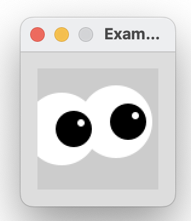
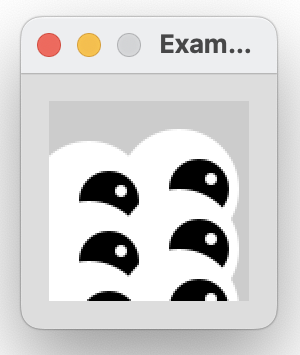

[BACK](/topics/topic06/lab06/00.html) [NEXT](/topics/topic06/lab06/02.html)

# Abstracting code to a method

In this step, you will draw many eyes (the examples 6.1 - 6.3 from your lectures).

## Coding the setup() method

Create a new Processing sketch in your workspace and call it **Example\_6\_1**.

Your display window should be 100x100.  Write the line of code that will ensure all subsequent shapes are drawn with no outline.

## Coding the draw() method

Include the following code in your sketch:

~~~java
void draw()
{
  background(204);
  fill(255);
  ellipse(50,50,60,60);    //outer white circle
  fill(0);
  ellipse(50+10, 50, 30, 30);  //black circle
  fill(255);
  ellipse(50+16, 46, 6, 6);  //small, white circle
}
~~~

Run your code; a single eye should be drawn.

Save your work.

## Drawing two eyes

With your **Example\_6\_1** sketch open, perform a *Save as...* and enter the name **Example\_6\_2**.

Now refactor the code above so that you have a method called **`eye`**.  This method should:

- accept two parameters of type int, representing the x and y coordinates of the eye.
- have a `void` return type.

Call the eye method twice from the draw method so that your display window is rendered like so:

Save your work.

## Drawing six eyes

With your **Example\_6\_2** sketch open, perform a *Save as...* and enter the name **Example\_6\_3**.

Now refactor the code to call the eye method six times from the draw method so that your display window is rendered like so:

Save your work.
