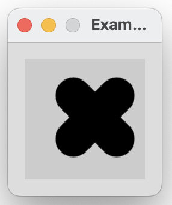
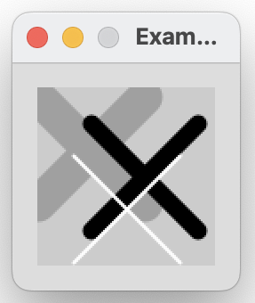
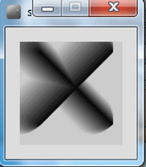

[BACK](/topics/topic06/lab06/01.html) [NEXT](/topics/topic06/lab06/03.html)

# Overloading methods

In this step, you will draw many X's (the processing examples 6.4 - 6.9 from your lectures).

## Coding the setup() method

Create a new Processing sketch in your workspace and call it **Example\_6\_4**.

Your display window should be 100x100 and have a light grey background.  

## Coding the drawX() method

Write a method called **drawX** that:

- has a void return type
- has an empty parameter list
- sets the stroke to light grey
- sets the weight of the stroke to 20
- draws two lines that intersect in the shape of an **X**

Call this method from the setup() method.

When you run your code, it should look like this:

Save your work.

## Coding a second drawX() method

With your **Example\_6\_4** sketch open, perform a *Save as...* and enter the name **Example\_6\_5**.

To the existing code, write another method called **drawX** that:

- has a void return type
- accepts a parameter of type int
- sets the stroke to the parameter
- sets the weight of the stroke to 20
- draws two lines that intersect in the shape of an **X**

In the setup() method, comment out the call to the previous draw method.  Now call this method instead, passing the value of 0 as a parameter.

When you run your code, it should look like this:

Save your work.

## Coding a third drawX() method

With your **Example\_6\_5** sketch open, perform a *Save as...* and enter the name **Example\_6\_6**.

To the existing code, write another method called **drawX** that:

- has a void return type
- accepts two parameters of type int
- sets the stroke to the first parameter
- sets the weight of the stroke to the second parameter
- draws two lines that intersect in the shape of an **X**

In the setup() method, comment out the call to the previous draw method.  Now call this method instead, passing the value of 0, 30 as parameters.

When you run your code, it should look like this:

Save your work.

## Coding a fourth drawX() method

With your **Example\_6\_6** sketch open, perform a *Save as...* and enter the name **Example\_6\_7**.

Write another method called **drawX** that:

- has a void return type
- accepts five parameters of type int
- sets the stroke to the first parameter
- sets the weight of the stroke to the second parameter
- draws two lines that intersect in the shape of an **X**.  The third parameter represents X, fourth represents Y and the fifth represents the size of the line.

In the setup() method, comment out the call to the previous draw method.  Now call this method instead, passing the values:  (0, 30, 40, 30, 35) as parameters.

When you run your code, it should look like this:

Save your work.

## Drawing multiple X's

With your **Example\_6\_7** sketch open, perform a *Save as...* and enter the name **Example\_6\_8**.

Using the most appropriate drawX method, reproduce the following output (you will have three individual method calls):

Save your work.

## Drawing shadowed X's

With your **Example\_6\_8** sketch open, perform a *Save as...* and enter the name **Example\_6\_9**.

Using the most appropriate drawX method and a for or while loop, reproduce the following output:

Save your work.

## Versioning Software

For our drawX project, you will notice that we now have 5 sketches, **Example\_6\_4** to **Example\_6\_9**.  This means that we have 5 different versions of the drawX project.  As we incrementally worked on our drawX project and got a new method working, we saved off that work and starting working in a new file.  This is a standard approach in programming and we will focus more on this approach throughout the course.  
