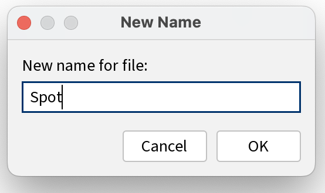

[BACK](/topics/topic06/lab06/04.html) [NEXT](/topics/topic06/lab06/06.html)

# Objects and Classes

## Drawing spot without classes

Create a new Sketchbook and save it as **Spot\_Version0.0**.

Enter the following code:

~~~java
float x = 33.0;
float y = 50.0;
float diameter = 30.0;

void setup(){
  size (100,100);
  noStroke();
}

void draw(){
  background(0);
  ellipse(x, y, diameter, diameter);
}
~~~

Run the code.  You should see a black window window with a white circle drawn in it.

Save your work.

## Drawing spot with basic class

Save your sketch as **Spot\_Version1.0**.

Replace the existing code with this (But DON'T Run it yet... ) :

~~~java
Spot sp;

void setup()
{
  size (100,100);
  noStroke();
  sp = new Spot();
  sp.xCoord = 33;
  sp.yCoord = 50;
  sp.diameter = 30;
}

void draw()
{
  background(0);
  ellipse(sp.xCoord, sp.yCoord, sp.diameter, sp.diameter);
}
~~~

Then using the **New Tab** button as below, create a new tab called Spot. (This will be the name of the new class)

Enter the following code in the new window.

~~~java
class Spot
{
  float xCoord, yCoord;
  float diameter;
}
~~~

Run the code.  You should see the same black window with a white circle drawn in it.

Save your work.

## Drawing spot with Spot class and constructor

Save your sketch as **Spot\_Version2.0**.

In the main tab, refactor the code so that it is the same as below:

~~~java
Spot sp;

void setup()
{
  size (100,100);
  noStroke();
  sp = new Spot(33, 50, 30);
}

void draw()
{
  background(0);
  ellipse(sp.xCoord, sp.yCoord, sp.diameter, sp.diameter);
}
~~~

Then go to the tab/class called *Spot* and refactor the code so that is has the following constructor:

~~~java
class Spot
{
  float xCoord, yCoord;
  float diameter;

  //Constructor
  Spot(float xPos, float yPos, float diamtr)
  {
    xCoord = xPos;
    yCoord = yPos;
    diameter = diamtr;
  }
}
~~~

Run the code.  You should see the same black window with a white circle drawn in it.

Save your work.

## Drawing spot with Spot class and multiple constructors

Save your sketch as **Spot\_Version3.0**.

In this step, we will make no changes in the *main* tab.

Go to the tab/class called *Spot* and refactor the code so that is also has the default constructor:

~~~java
class Spot{
  float xCoord, yCoord;
  float diameter;

  //Default Constructor
  Spot(){
  }

  //Constructor
  Spot(float xPos, float yPos, float diamtr){
    xCoord = xPos;
    yCoord = yPos;
    diameter = diamtr;
  }
}
~~~

Run the code.  Once again, you should see the same black window with a white circle drawn in it.

Save and close your work.
