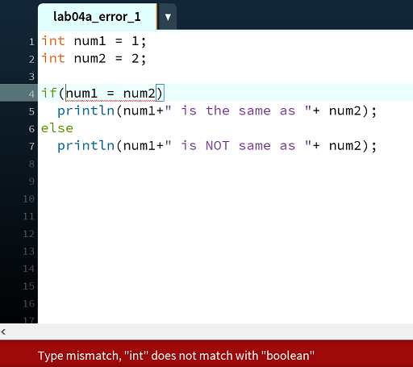
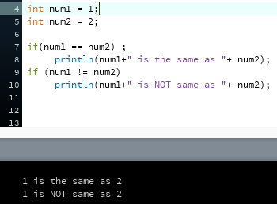
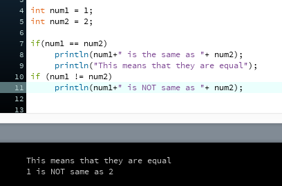

[BACK](/topics/topic06/lab06/05.html) [NEXT](/topics/topic06/lab06/07.html)

# Exercise

In these exercises, we will look at solving some common errors.

## Exercise 1: Using ''='' in test for equality (syntax error)

Create a new sketch and save it as **lab06\_exercise\_1**.

Cut and paste the following code into it:

~~~java
        int num1 = 1;
        int num2 = 2;

        if(num1 = num2)
             println(num1+" is the same as "+ num2);
        else
             println(num1+" is NOT same as "+ num2);
~~~

Try to run the code. You will see an error similar to this one:

Change the single ''='' to a double equals ''=='' Rerun the code.  It should now work.

Save your work.  

## Exercise 2: Using '';'' in incorrect place(logic)

Save your sketch as **lab06\_exercise\_2**.

Replace the code in it with this (cut and paste is fine here!):

~~~java
int num1 = 1;
int num2 = 2;

if(num1 == num2) ;
     println(num1+" is the same as "+ num2);
if (num1 != num2)
     println(num1+" is NOT same as "+ num2);
~~~

Run the code. You will get the folowing (incorrect) output.

Can you see where the error is? Change the code to that you get the correct output ("1 is not the same as 2").

If you are having difficulty spotting it, the error is in the first if statement...there should be no ; after the boolean expression.

Save your work.

## Exercise 3: Not using ''{'' and ''}'' to control statements(logic)

Save your sketch as **lab06\_exercise\_3**.

Replace the code in it with this (cut and paste is fine here!):

~~~java
int num1 = 1;
int num2 = 2;

if(num1 == num2)
     println(num1+" is the same as "+ num2);
     println("This means that they are equal");
if (num1 != num2)
     println(num1+" is NOT same as "+ num2);
~~~

Run the code. You will get the folowing (incorrect) output.

Can you see where the error is?   Hint: there is a problem with curly braces...recall that curly braces are not required in an if statement when there is only one statement in it; they are required when there is more than one statement.

Change the code to that you get the correct output in each case (when numbers are equal and when numbers are not equal).

Save your work.
