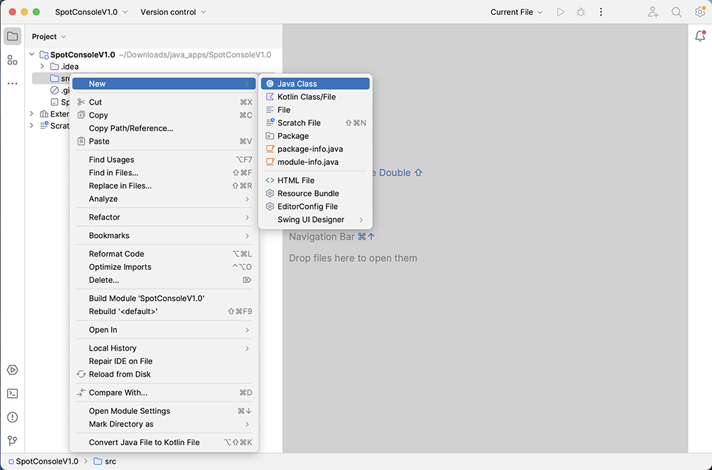

[BACK](/topics/topic07/lab07/00.html) [NEXT](/topics/topic07/lab07/02.html)

# Verifying IntelliJ Installation

The purpose of this step is to verify that your IntelliJ installation is working correctly.  Please do this step regardless of whether you are using the college computers or your own computer. 

## Launch IntelliJ

Locate your IntelliJ application and start it (in windows, one easy way is to click on the search icon on your task bar and enter *IntelliJ*).

If this is your first time starting IntelliJ, you will probably be presented with a series options i.e. you **might** be:

- asked if you want to import settings...you don't need to import any settings.  

- presented with the User Licence Agreement...you will need to scroll to the bottom of this and accept it.

- asked if you want to share anonymous data with Jetbrains (decide if you want to do this or not) and click the OK button.

IntelliJ should now startup:

## Creating your first Java Program

Click the **New Project** button.  You should now see something like this:

If your installation says **No JDK** exists for the **Project JDK** OR it doesn't point to the latest version you just installed, click on the Project JDK box:

If the latest version of Java appears in the list, select it.  If it doesn't appear in the list, click the **+ Add SDK** option and locate the version of Java you just installed.

Now that we have a valid Project JDK, go ahead and enter the project name as **`SpotConsoleV1.0`**.  

You will notice that your Project location changes automatically as you type, so I'd recommend changing it to something easy to remember in an easily accessible location on your computer.

Make sure the Language is `Java` and the Build System is `IntelliJ` like this :

and finally click the **`Create`** button.  

A new project is created for you (and a new folder location if one didn't exist previously):

Close the **Tip** window, if it appears.  

## Creating your first class

Right click on the **src** folder and select *New*, *Java Class*.  

Name the class **`Driver`**. 

Your new `Driver` class should now be created:

Add the following method to the **Driver** class:

~~~java
    public static void main(String args[]){
        System.out.println("Hello World");
    }
~~~

## Running your first Java Program

This program, when run, will print ***Hello World*** into the console window.  

To run the program, click on the green triangle beside the main method.  Then select *Run ‘Driver.main()’*:

***Hello World*** should be printed to the console:

If you are not getting this result, you should flag this to your lecturer who can help diagnose and resolve the issue.

