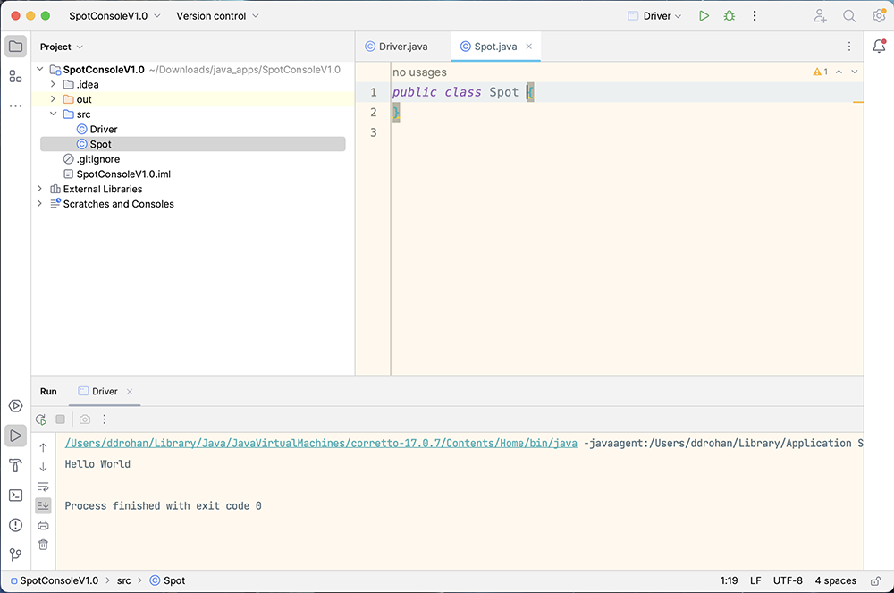
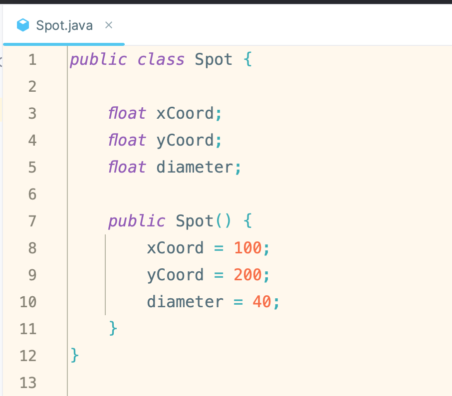
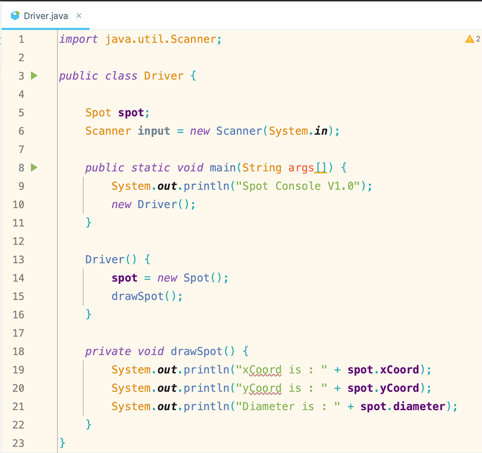
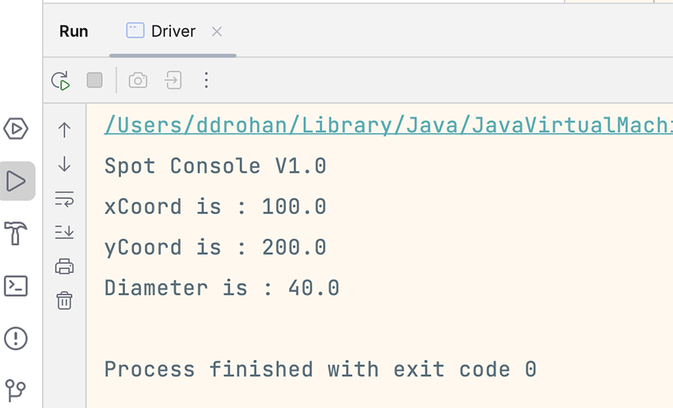

[BACK](/topics/topic07/lab07/01.html) [NEXT](/topics/topic07/lab07/03.html)

# Spot Console V1.0

This console based app will display the `xCoord`, `yCoord` and `diameter` details to the user, along with calculations for the circle radius, area and circumference.

During this step, you may need to view this weeks lecture notes to remind you how to write classes.

We created the **`SpotConsoleV1.0`** project in the previous step, so we will continue working in this project.

When code is given in labs, avoid the temptation to cut and paste it in (unless told explicitly to do so).  Typing in code maximises your learning!

## Creating Classes

Within the **`SpotConsoleV1.0`** project, right click on the *src* folder and select *New* followed by *Java Class*.

When the dialog appears, enter **Spot** as the class name.  You now should have an empty class like this:

In the Spot class, create three public instance fields:

- `xCoord` of type **float**
- `yCoord` of type **float**
- `diameter` of type **float**

Write a default constructor for this class (that takes in no parameters).  This constructor should update fields like so:

- `xCoord` = 100
- `yCoord` = 200
- `diameter` = 40

The code will look like this:

## Driver Class

In the Driver class, create one  instance field called `spot` and instantiate it by calling the default Spot constructor.

Then create a new method called `drawSpot()`:

~~~java
    void drawSpot(){
        System.out.println("xCoord is:   " + spot.xCoord);
        System.out.println("yCoord is:   " + spot.yCoord);
        System.out.println("diameter is: " + spot.diameter);
    }
~~~

Add a `Driver` constructor to call this new method:

~~~java
    Driver(){
        spot = new Spot();
        drawSpot();
    }    
~~~

And finally replace your main method with this code (to call the Driver constructor): 

~~~java
   public static void main(String args[]) {  
	    System.out.println("Spot Console V1.0");  
	    new Driver();  
}
~~~

Your class `Driver` code should look something like this:
(you can ignore the Scanner class for the moment :) )

## Run the App

Run the app by clicking on the green triangle beside the main method in `Driver`.

Your output should look like this:

 
 Save your work.