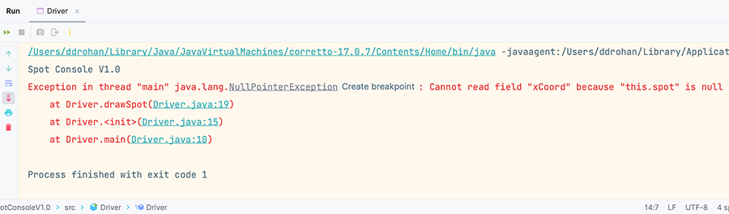

[BACK](/topics/topic07/lab07/02.html) [NEXT](/topics/topic07/lab07/04.html)

# Null Pointer Exception

We are going to crash the program with a `NullPointerException`

In `Driver`, we should have the following code:

~~~java
public class Driver {  
  
    Spot spot;  
    Scanner input = new Scanner(System.in);  
  
    public static void main(String args[]) {  
        System.out.println("Spot Console V1.0");  
        new Driver();  
    } 
     
    Driver() {  
        spot = new Spot();  
        drawSpot();  
    }  
    
    private void drawSpot() {  
        System.out.println("xCoord is : " + spot.xCoord);  
        System.out.println("yCoord is : " + spot.yCoord);  
        System.out.println("Diameter is : " + spot.diameter);  
	    }
    }
~~~

Remove this line of code from the `Driver` constructor:

~~~java
    spot = new Spot();
~~~

You can simple comment it out for the moment like this:

~~~java
//    spot = new Spot();
~~~

and run your program again.

## NullPointerException

Your program should crash with the following error:

This is a `NullPointerException` which means that you haven't called the constructor for an object (i.e. spot) before you started calling methods in the class (i.e. spot.getXCoord()).  Notice in the output above the second line in the error is telling you that there was an error in Driver.java at line 19:

~~~java
	Driver.drawSpot(Driver.java:19)
~~~

This is the exact line of code that crashed the program.  

Also, note that the exit code of the program is no longer zero, it is 1, indicating that the program didn't end 'gracefully'.

## Replace the line of code

Now change the line of code back to it's original state:

~~~java
    spot = new Spot();
~~~

and run the program again to make sure it is no longer crashing.

