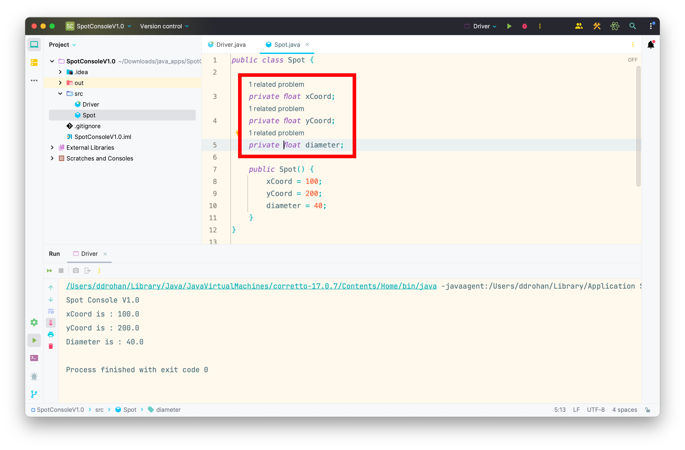
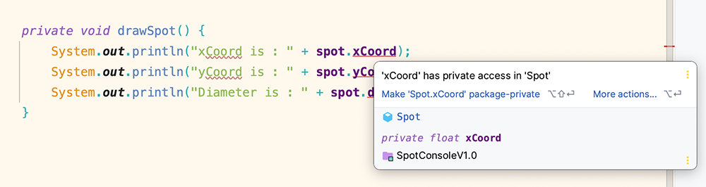

[BACK](/topics/topic07/lab07/03.html) [NEXT](/topics/topic07/lab07/05.html)

# Private Fields

In object oriented languages, there is a rule called Encapsulation (data hiding) that your classes should follow.  

This means that in `Spot`, we should have declared these fields as `private`:

- `xCoord`
- `yCoord`
- `diameter`

Make that change now and you will see that it generates problems:

The reason we are having a problem is that we have directly accessed each of these fields in the Driver class i.e.:

Because we have made these three fields `private`, the `Driver` can no longer see them.  But we need them `private`.  

To fix this problem, we need to make the following changes, so that we are following the rules of **Encapsulation**:

- In **`Spot`**, add the following accessor methods so that **`Driver`** can now see the contents of `xCoord`, `yCoord`, and `diameter`:

~~~java
    public float getxCoord() {
        return xCoord;
    }

    public float getyCoord() {
        return yCoord;
    }

    public float getDiameter() {
        return diameter;
    }
~~~

- In **`Driver`**, update the `drawSpot` method to use these accessors instead of directly accessing the fields:

~~~java
    void drawSpot(){
        System.out.println("xCoord:        " + spot.getxCoord());
        System.out.println("yCoord:        " + spot.getyCoord());
        System.out.println("diameter:      " + spot.getDiameter());
    }
~~~

Now the problem should have resolved itself.  

Run the app again to make sure all is working as expected and save your work. 

