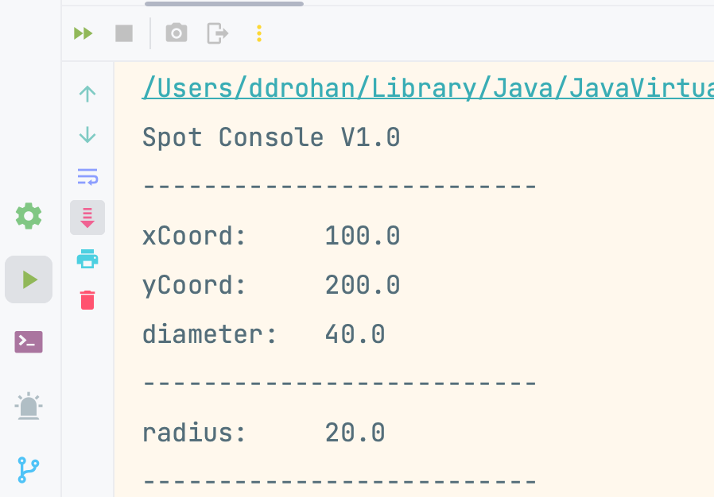

[BACK](/topics/topic07/lab07/04.html) [NEXT](/topics/topic07/lab07/06.html)

# Radius

In this step, we are going to add functionality to the app that will calculate the radius of the Spot and print it to the console.

## Some basic responsibilities

We will follow these basic rules when adding more functionailty:

- **`Spot`** class does not *talk* to the console, so there will never be any printing or reading from the console done in this class.  The responsibility of Spot is to manage the details relating to a single spot object. 

- **`Driver`** class is the one that *talks* to the user.  All prints and reads will be done from here.  Driver creates an object of type `Spot` and calls the methods of the Spot class over this object. 

## Calculate Radius - Spot Class

Now that we know the basic responsibilities of the two classes in this app, we can make the changes to calculate the radius.  

In `Spot`, the radius should be calculated and returned to whichever class called the method i.e. add the following code to `Spot`:

~~~java
public float calculateRadius(){
    return diameter/2;
}
~~~

## Print Radius - Driver Class

And in `Driver`, add a new method that will call the calculateRadius method in `Spot` to print the value to the console:

~~~java
void printRadius(){
    System.out.println("radius:   " + spot.calculateRadius());
}
~~~

Lastly, let's call this new Driver method by updating the `Driver()` constructor to be:

~~~java
Driver() {  
    spot = new Spot();  
    drawSpot();  
    printRadius();  
}
~~~

## Run the app

Now run the app and verify that the correct value for the radius is being printed to the console:

## Update UI (user interface)

Make some changes to how the console output is rendered e.g. in our case, we added a few lines with dashes on them to separate the output a bit:

