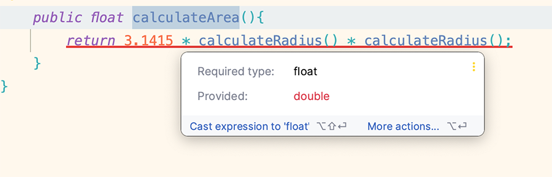
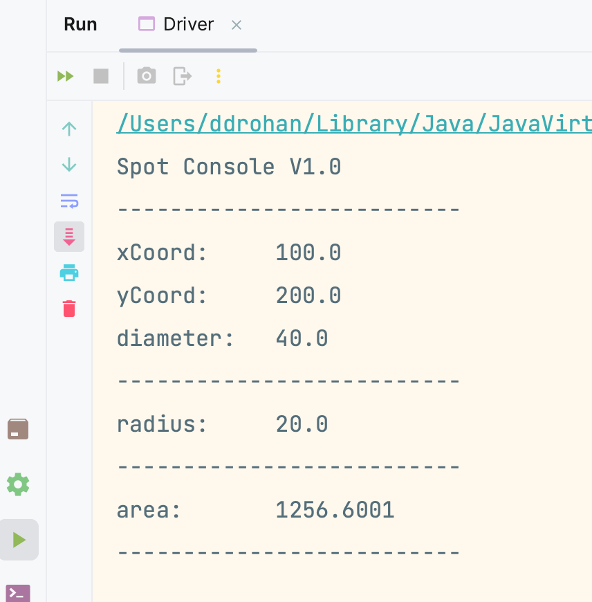
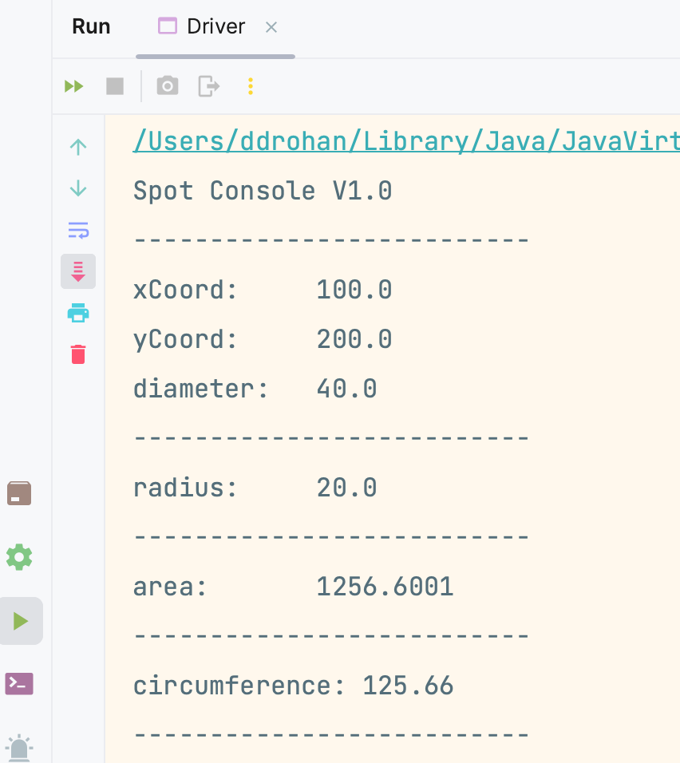

[BACK](/topics/topic07/lab07/05.html) [NEXT](/topics/topic07/lab07/07.html)

# Area and Circumference

Here we will add  functionality to calculate the area of the Spot and print it to the console.

## Calculate Area - Spot changes

In `Spot`, the area should be calculated and returned to whichever class called the method i.e. add the following code to `Spot`:

~~~java
    public float calculateArea(){
        return 3.1415 * calculateRadius() * calculateRadius();
    }
~~~

However, this code generates a syntax error:

It is complaining that the value of PI is, by default, a `double` but our method return type is a `float`.  We have two choices here to fix this error:
- change the return type of calculateArea to be double OR
- add an f straight after the value of PI to indicate that the value 3.1415 is a float i.e. `3.1415f`.

You can decide which fix you would like to take.

## Print Area - Driver changes

In `Driver`, add a new method that will call the `calculateArea` method in `Spot` to print the value to the console:

~~~java
    void printArea(){
        System.out.println("area:          " + spot.calculateArea());
    }
~~~

Lastly, (if you haven't done so already) add the following to `Driver`:

~~~java
void printLine() {  
    System.out.println("--------------------------" );  
}
~~~

and let's call these new Driver methods by updating the `Driver()` constructor to be:

~~~java
 Driver() {  
    spot = new Spot();  
    printLine();  
    drawSpot();  
    printLine();  
    printRadius();  
    printLine();  
    printArea();  
    printLine();  
}
~~~

## Run the app

Now run the app and verify that the correct value for the area, along with the other output, is being printed to the console.

If necessary, make some changes to the UI so that you have neat output, like so:

# Circumference

Next, we will add functionality to calculate the circumference of the Spot and print it to the console.

## Calculate Circumference - Spot changes

In `Spot`, the circumference should be calculated using the following formula:

- 2 x PI x radius.

Add a new method, called `calculateCircumference` that will return the value of this calculation. 

## Print Circumference - Driver changes

In `Driver`, add a new method that will call the `calculateCircumference` method in `Spot` to print the value to the console.  Model this new method on the `printArea` approach.

Lastly, call the `printCircumference` method as the last method call in the `Driver()` constructor.

## Run the app

Now run the app and verify that the correct value for the circumference, along with the other output, is being printed to the console.

If necessary, make some changes to the UI so that you have neat output.

