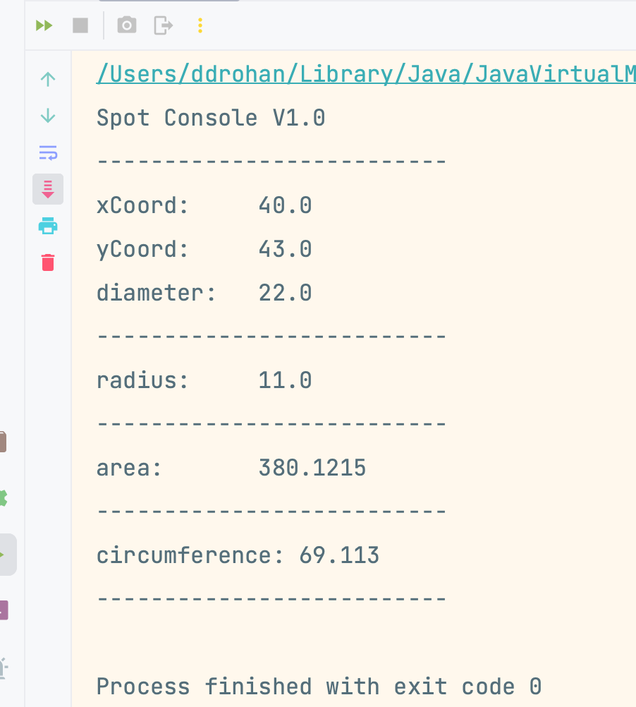
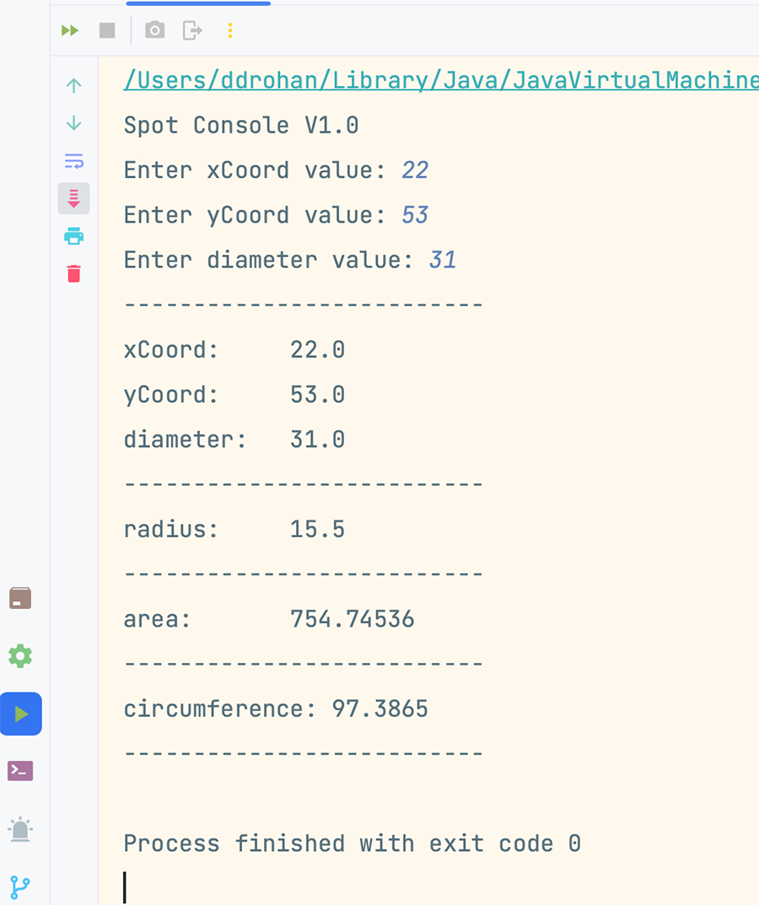

[BACK](/topics/topic07/lab07/06.html) [NEXT](/topics/topic07/lab07/08.html)

# Add Spot

In `Spot`, we have hard-coded the values for `xCoord`, `yCoord` and `diameter` in the default constructor:

~~~java
    private float xCoord;
    private float yCoord;
    private float diameter;

    public Spot() {
        xCoord = 100;
        yCoord = 200;
        diameter = 40;
    }
~~~

Now add a second `Spot` constructor that will allow us to read in the values for these fields from the `Driver` class:

~~~java
public Spot(float xCoord, float yCoord, float diameter) {
    this.xCoord = xCoord;
    this.yCoord = yCoord;
    this.diameter = diameter;
}
~~~

## Testing new constructor

Let's test this constructor from the `Driver`, before we start allowing the user to type in values from the console for Spot.  

To do this, return to `Driver` and do the following:

remove this line from the Driver constructor:

~~~java
    spot = new Spot();
~~~

and update the Spot declaration:

~~~java
    Spot spot;
~~~

with

~~~java
    Spot spot = new Spot(40, 43, 22);
~~~

When you run the app, are the new values that you entered into the constructor displayed on the console:

## Asking the user for the values

Now we will update the `Driver` class so that we can ask the user to enter the values for this new constuctor, rather than us hardcoding the value like above. 

In `Driver`, add the following new field, just below the `Spot` variable declaration, if you haven't done so already:

~~~java
Scanner input = new Scanner(System.in);
~~~

It will give you a syntax error if you are missing the following import:

~~~java
import java.util.Scanner;
~~~

so add that now if necessary.

Still in `Driver`, add the following new method:

~~~java
    void addSpotDetails(){
        System.out.print("Enter xCoord value: ");
        float enteredXCoord = input.nextFloat();
        System.out.print("Enter yCoord value: ");
        float enteredYCoord = input.nextFloat();
        System.out.print("Enter diameter value: ");
        float enteredDiameter = input.nextFloat();
        spot = new Spot(enteredXCoord, enteredYCoord, enteredDiameter);
    }
~~~

and call it as the first method in the `Driver()` constructor i.e.:

~~~java
     Driver(){
        addSpotDetails();
        drawSpot();
        printRadius();
        printArea();
        printCircumference();
    }
~~~

##  Run the app

Now run the app and you should be asked to enter in values for the spot fields:

Return back to the code and try figure out what is happening with the reads.  We will cover this in more detail next week.

The complete **`Driver`** class now looks like this (with a few changes for the UI display)

~~~java
import java.util.Scanner;  
  
public class Driver {  
  
    Spot spot = new Spot(40, 43, 22);  
    Scanner input = new Scanner(System.in);  
  
    public static void main(String args[]) {  
        System.out.println("Spot Console V1.0");  
        new Driver();  
    }  
      
     Driver(){
        addSpotDetails();
        drawSpot();
        printRadius();
        printArea();
        printCircumference();
    }
    
    void drawSpot(){  
        printLine();  
        System.out.println("xCoord:     " + spot.getxCoord());  
        System.out.println("yCoord:     " + spot.getyCoord());  
        System.out.println("diameter:   " + spot.getDiameter());  
        printLine();  
    }  
    
    void printRadius(){  
        System.out.println("radius:     " + spot.calculateRadius());  
        printLine();  
    } 
     
    void printArea(){  
        System.out.println("area:       " + spot.calculateArea());  
        printLine();  
    }  
    
    void printCircumference(){  
        System.out.println("circumference: " + spot.calculateCircumference());  
        printLine();  
    }  
    
    void addSpotDetails(){  
        System.out.print("Enter xCoord value: ");  
        float enteredXCoord = input.nextFloat();  
        System.out.print("Enter yCoord value: ");  
        float enteredYCoord = input.nextFloat();  
        System.out.print("Enter diameter value: ");  
        float enteredDiameter = input.nextFloat();  
        spot = new Spot(enteredXCoord, enteredYCoord, enteredDiameter);  
    }  
    
    void printLine() {  
        System.out.println("--------------------------" );  
    }  
}
~~~