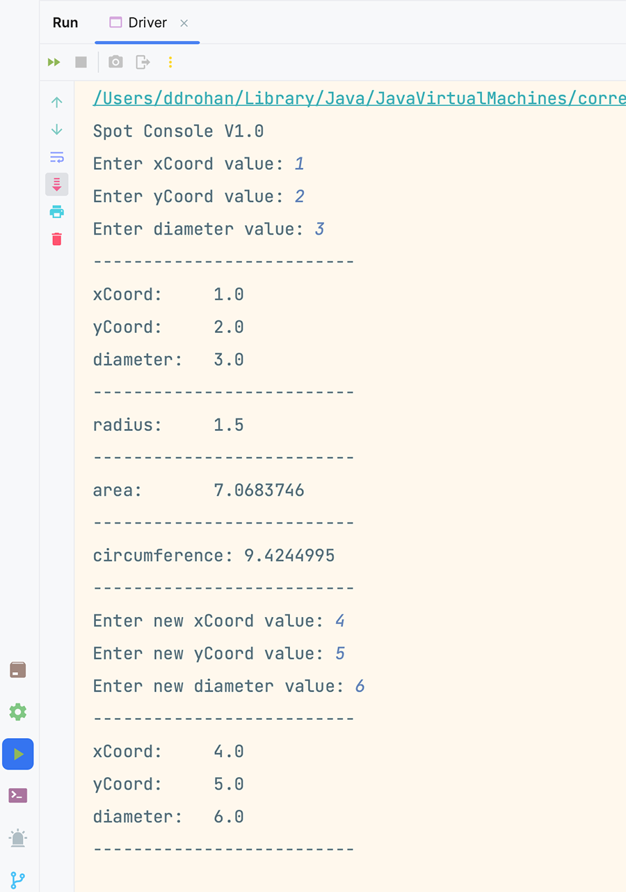

[BACK](/topics/topic07/lab07/07.html) [NEXT](/topics/topic07/lab07/09.html)

# Update Spot

We will now look at updating the stored values in the `Spot` fields. 

Recall that:
- fields in `Spot` are private.  
- "get" methods were provided to view the contents of these fields.
- other methods were provided to calculate the area, radius and circumference.

However, there is no mechanism / methods provided to update the instance fields.  If we want to provide this functionality, we have to add the following methods 'set' methods to `Spot`, one for each instance field:

~~~java
public void setxCoord(float xCoord) {
    this.xCoord = xCoord;
}

public void setyCoord(float yCoord) {
    this.yCoord = yCoord;
}

public void setDiameter(float diameter) {
    this.diameter = diameter;
}
~~~

Now `Spot` is ready to update the contents of each of it's fields; we just need to ask the user for the new value and update the contents with it. 

## `Driver` changes

In Driver, we have several methods that allow us to:
- add a spot (user provides the information)
- draw spot (print out the contents of the fields - using 'get' methods)
- print area
- print circumference
- print radius

We now need to add a method that will allow us to update the contents of the `Spot` fields using the new 'set' methods we just added above.

Add the following method:

~~~java
void updateSpotDetails(){
    System.out.print("Enter new xCoord value: ");
    float enteredXCoord = input.nextFloat();
    System.out.print("Enter new yCoord value: ");
    float enteredYCoord = input.nextFloat();
    System.out.print("Enter new diameter value: ");
    float enteredDiameter = input.nextFloat();
    spot.setxCoord(enteredXCoord);
    spot.setyCoord(enteredYCoord);
    spot.setDiameter(enteredDiameter);
}
~~~

And then update the `Driver()` constructor to call this new method and then redraw the spot (so we can see the new values):

~~~java
    Driver(){
        addSpotDetails();
        drawSpot();
        printRadius();
        printArea();
        printCircumference();
        //update spot details and redraw spot
        updateSpotDetails();
        drawSpot();
    }
~~~

## Run the app

When you run the app, you should have output similar to this:

Save your work.