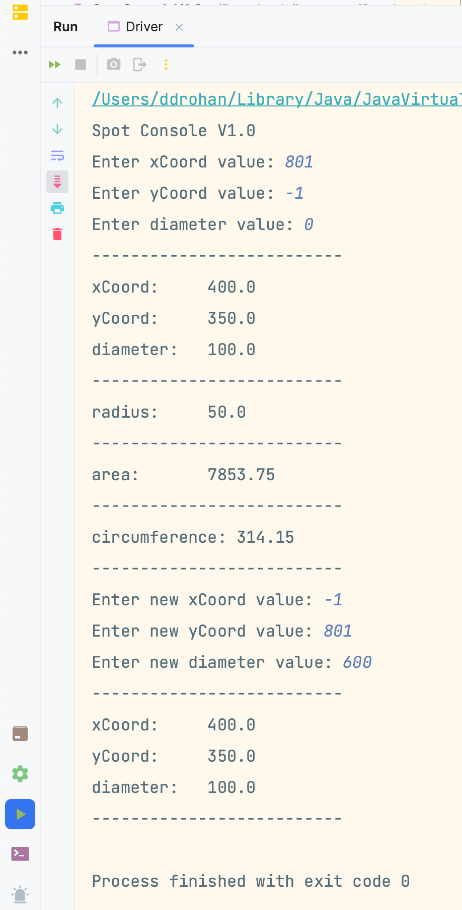

[BACK](/topics/topic07/lab07/08.html) [NEXT](/topics/topic07/lab07/10.html)

# Validate Spot

At this stage, we can add and update the fields in the `Spot` class.  

We will now add a bit of validation to these fields to make sure that we end up with appropriate data in them.  

For example:

- we don't want to have any negative values entered for any of the fields.  
- we don't want a diameter of zero either, as no spot would be drawn in that case. We also want our diameter values less than 600.
- we are ok with zero values for the xCoord and yCoord because these are legitimate values on the geometry plane.  However, we don't want any values larger than 800.

## Validation rules for Spot

So, this means that we are going to add the following validations:

- `xCoord` value must greater than or equal to zero and less than or equal to 800.  If an incorrect value is supplied by the user, apply a default value of 400.
- `yCoord` value must greater than or equal to zero and less than or equal to 700. If an incorrect value is supplied by the user, apply a default value of 350.
- `diameter` value must greater than zero and less than 600. If an incorrect value is supplied by the user, apply a default value of 100.

## Implementing the Validation Rules for Spot

In `Spot`, update the field declarations to have the default values listed above:

~~~java
    private float xCoord = 400;
    private float yCoord = 350;
    private float diameter = 100;
~~~

Now update the `setXCoord` to have the following validation:

~~~java
    public void setxCoord(float xCoord) {
        if ((xCoord >= 0) && (xCoord <= 800)) {
            this.xCoord = xCoord;
        }
    }
~~~

Now try update the `setYCoord` and `setDiameter` methods yourself, using the validation rules above.

Lastly, update the constructor from:

~~~java
    public Spot(float xCoord, float yCoord, float diameter) {
        this.xCoord = xCoord;
        this.yCoord = yCoord;
        this.diameter = diameter;
    }
~~~

to this (which calls the 'set' methods to apply the validation rules): 

~~~java
    public Spot(float xCoord, float yCoord, float diameter) {
        setxCoord(xCoord);
        setyCoord(yCoord);
        setDiameter(diameter);
    }
~~~

## Run the app

Now run the app and test on the boundaries of these if statments.  What this means is that xCoord should have tests for the following input:

- -1
- 0
- 1
- 799
- 800
- 801

This is called **boundary testing** as we are testing above, below and exactly the values in the if statement.  

You can see we have input some boundary tests into our app (note how the default values are applied):

