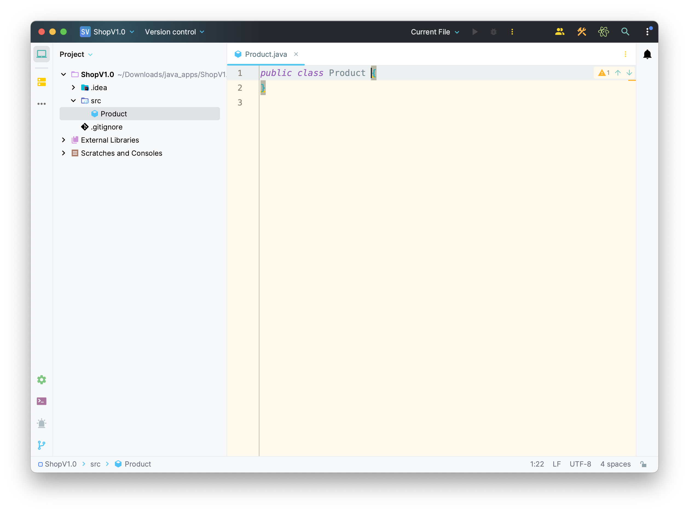
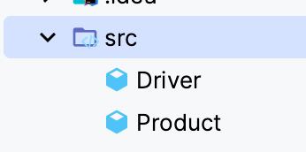
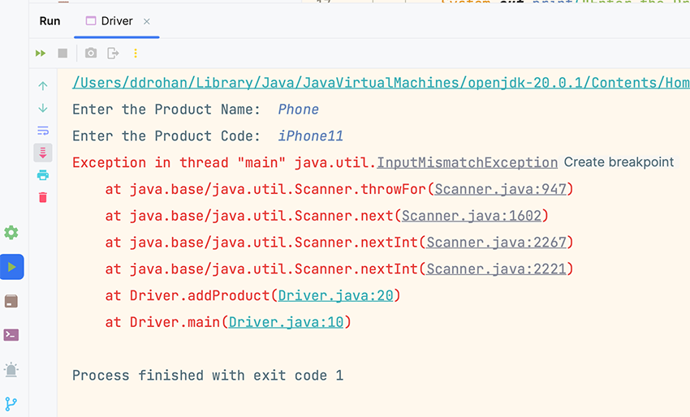
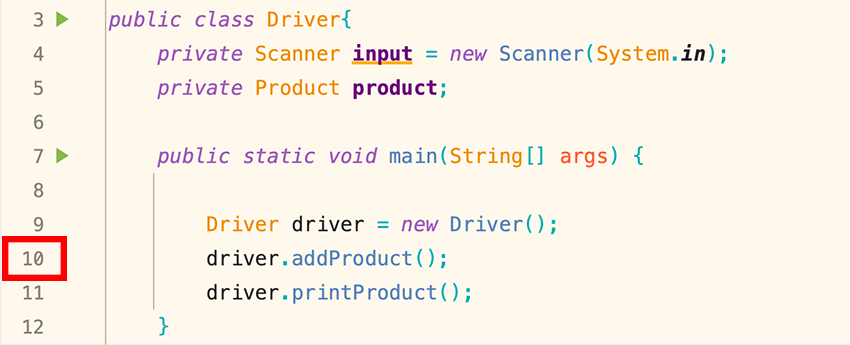
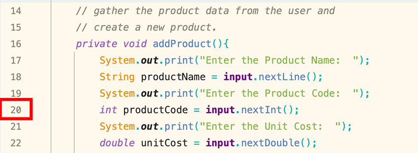
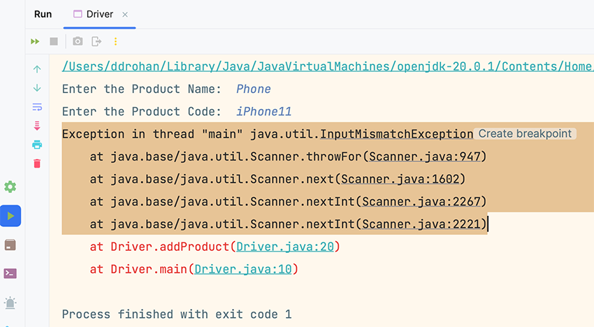

[BACK](/topics/topic08/lab08/00.html) [NEXT](/topics/topic08/lab08/02.html)

# ShopV1.0

- This console based app will ask the user to enter details for one Product.  The details of the product will be printed back to the user.

- During this step, you may need to view this weeks lecture notes to remind you how to write classes.

- In IntelliJ, create a new Java Project called **ShopV1.0** (don't use a template).

- When code is given in labs, avoid the temptation to cut and paste it in (unless told explicitly to do so).  Typing in code maximises your learning!

## Creating Classes

Within the ShopV1.0 project, we will create two new classes, one called **Product** and the other called **Driver**.

To create a class called **Product**:

- Right click on the *src* folder and select *New* followed by *Java Class*.

- When the dialog appears, enter **Product** as the class name.  You now should have an empty class like this:

Repeat this process to create a class called **Driver**.

Your folder structure should look like this:

Note: refer to the lecture materials for this week, if you can't remember the exact format of the following fields/methods.

## Product Class

In the Product class, create four private instance fields:

- `productName` of type **String**
- `productCode` of type **int**
- `unitCost` of type **double**
- `inCurrentProductLine` of type **boolean**

Write a constructor for this class that takes the four instance fields as parameters and updates the object state using these parameters.  Note: no need for field validation yet.

Write a getter for each instance field.  

Write a setter for each instance field.  Note: no need for field validation yet.

Write a toString method that builds and returns a String comprising a user friendly representation of the object state.

## Driver Class

In the Driver class, create two private instance fields:

- `input` of type **Scanner** (initialise this field using **new Scanner(System.in)**)
- `product` of type **Product**

Write a method called **addProduct()** that asks the user to input the details of the product (name, code, unit cost and whether or not it is in the current product line).  Use this data to create a new Product object i.e.

~~~java
System.out.print("Enter the Product Name:  ");
String productName = input.nextLine();
System.out.print("Enter the Product Code:  ");
int productCode = input.nextInt();
System.out.print("Enter the Unit Cost:  ");
double unitCost = input.nextDouble();

//Ask the user to type in either a Y or an N.  This is then
//converted to either a True or a False (i.e. a boolean value).
System.out.print("Is this product in your current line (y/n): ");
char currentProduct = input.next().charAt(0);
boolean inCurrentProductLine = false;
    if ((currentProduct == 'y') || (currentProduct == 'Y'))
            inCurrentProductLine = true;

product = new Product(productName, productCode, unitCost, inCurrentProductLine);
~~~

Write a method called **printProduct()** that prints all the product to the console.  Hint: use the toString() method from the Product class to print a product.

Write a **main** method that has the following code:

~~~java
public static void main(String[] args) {
    Driver driver = new Driver();
    driver.addProduct();
    driver.printProduct();
}
~~~

## Run the App

Run the app; does all work as expected?  Are you asked to enter the product details?  Are all details you entered printed back to the console?  

## Crashing your Program

We are going to crash the program with an `Exception`.  In a few weeks, we will look at the code required to handle and recover from this, but at the moment, we are just raising awareness of it.

Run your program again and start typing in the following details:

- "Phone" for Product Name
- "iPhone11" for Product Code

Your program will crash with a similar *call stack dump*:

Notice the exit code of the program is 1...it is usually 0 which means the process ended successfully.

The program crashed because we were expecting the user to type in an `int` for *Product Code*, however they typed in a *String*.  We used a Scanner method `nextInt()` to read this input and as it was a String, the program couldn't handle it, so it crashed.  

Looking at the red text in the `call stack dump`, we start at the last line printed on the screen and work our way upwards/backwards.  

NOTE: your line numbers will probably differ depending on how you've written your code.

So, we can see the last line printed was:

~~~java
    at Driver.main(Driver.java:10)
~~~

This means that, in the Driver class (from my code), in the main method, on line 10, there was a method call made.  If we look at our code, we can see that the method call was *addProduct*:

The second last red line printed to the console was:

~~~java
    at Driver.addProduct(Driver.java:20)
~~~

Again looking at our code, we can see that, within the addProduct method, line 20 was the read of the Product Code input from the user:

Now looking at the remaining red text in the console, we can see that the other calls are made from the Scanner class itself in Java, with the top line stating the actual `Exception`, which is `InputMismatchException`:

So, putting all this together, the call stack dump is telling us that:

- On line 10 in Driver.java, you called a method `addProduct()`
- Then, on line 20 within this addProduct() method, you called a line of code:  `int productCode = input.nextInt();`
- Control was transferred to the Scanner class in Java and because we typed in a String for our product code, the Scanner class crashed with an InputMismatchException i.e. they wanted an int and we provided a String.

We will look at how to stop this Exception from crashing our program in future lectures and labs.
