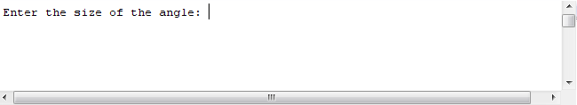
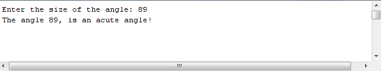
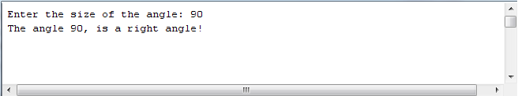
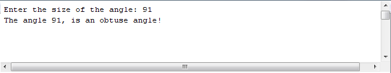
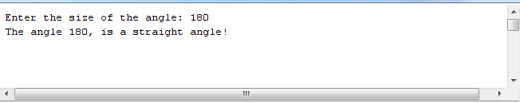
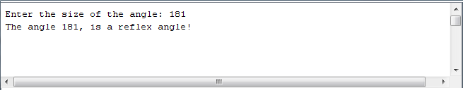

[BACK](/topics/topic08/lab08/01.html) [NEXT](/topics/topic08/lab08/03.html)

# 3. Exercise - Scanner

This exercise will help you become more familiar with the Scanner class.

## What are you being asked to do?

Write a **single** class app that uses Scanner to ask the user to type in the value of an angle:

If the angle is less than 90, print out acute angle, e.g.:

If it is exactly 90, print out right angle, e.g.:

If it is more than 90 but less than 180, print out obtuse angle, e.g.:,

If it is exactly 180, print out straight angle, e.g.:

If it is otherwise, print out reflex angle, e.g.:

## How do I code that?

In IntelliJ, create a new Java Project called **AngleProject**.

Create a class called **Angle**.    

Import the Scanner class; recall that this must be the first line in your file.

Add a **main** method to the class and in this method:

- Create an object of the Scanner class.

- Ask the user to enter an angle and store it (you can determine the variable type from the screen shots above).

- Call the **processAngle** method (defined below) passing, as the parameter, the angle value that you just read in.

## processAngle() method

Create a private method, with a void return type and call it **processAngle**.  It should accept one parameter of type **int**.

This method interrogates the parameter value and prints the type of angle it is to the screen (according to the screen shots above).

## Run the App

Run the app; does all work as expected?
