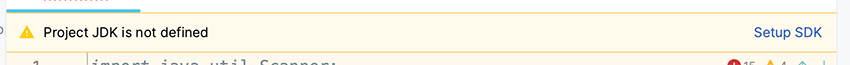
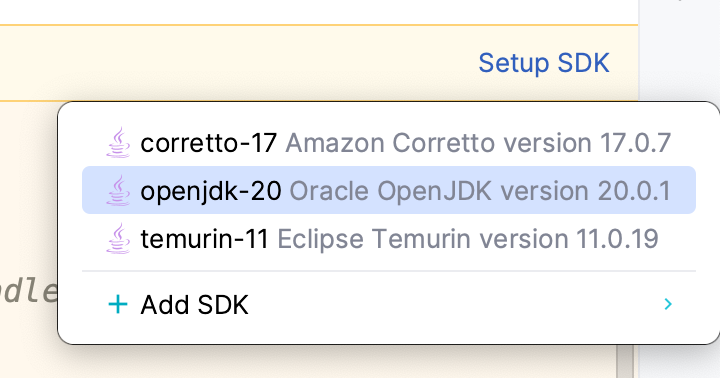

[BACK](/topics/topic08/lab08/03.html) [HOME](/index.html)

# 5. Solutions

NOTE: If you download and extract the Solutions you may get the following error message in IntelliJ:

So just select **`Setup JDK`** and the correct version (below) and it should build correctly.

[ShopV1.0](archives/ShopV1.0.zip)

[Exercise - AngleProject](archives/AngleProject.zip)

[Challenge - GymApp1.0](archives/GymApp1.0.zip)
