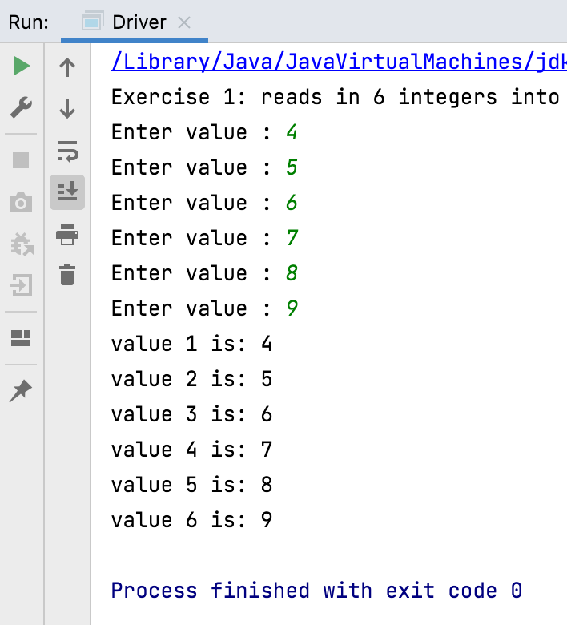

[BACK](/topics/topic09/lab09/01.html) [NEXT](/topics/topic09/lab09/01.html)

# Demo Exercise

This step introduces a way to write, keep and check your exercises on IntelliJ.

For each exercise, you should write the code in its own method and give it a similar method header to this, where X is the number of the exercise:

~~~java
    private void exerciseX()
~~~

Don't delete any of the exercise code you write in this lab, make sure you start a new method for each exercise, using the above approach.

## Exercise 1

Perform these steps:

- In IntelliJ, create a new Project called **ArrayExercises**.

- Create a new class in this Project called **Driver**.  Within this class, declare a Scanner object called `input` and also create a new main method with the following code:

~~~java

    public static void main(String[] args) {
        new Driver();
    }

    public Driver(){
        exercise1();   
    }
~~~

- In Driver, write a method `exercise1` that will read in 6 integers into an integer array and then print out the values to the screen.

- Run your code to see does it work as expected.

## Solution to Exercise 1

Note how, at the start of the `exercise1` method, we briefly printed out what the exercise is doing too.

~~~java
import java.util.*;

public class Driver {

    private Scanner input = new Scanner (System.in);

    public static void main(String[] args) {
        new Driver();
    }

    public Driver(){
        exercise1();   
    }

    public void exercise1() {
        System.out.println("Exercise 1: reads in 6 integers into an integer array and prints the values to the screen.");

        int[] numbers = new int[6];

        for (int i = 0; i < numbers.length ; i++) {
            System.out.print("Enter value : ");
            numbers[i] = input.nextInt();
        }

        for (int i = 0; i < numbers.length ; i++) {
            System.out.println("value " + (i+1)  + " is: " + numbers[i]);
        }
    }

}
~~~
