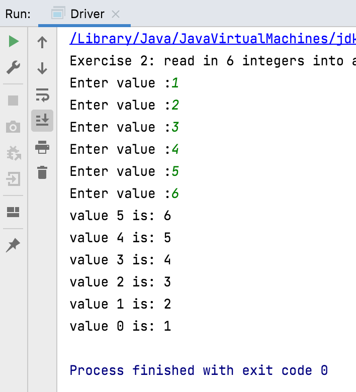
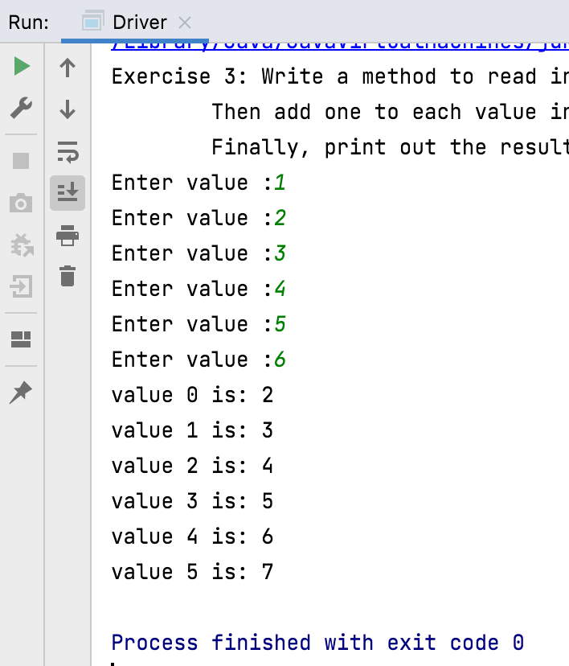

# Exercises - int

Using the same method naming system, attempt the following exercises.

In each case:

- Add a method to the Driver class as written in the previous step.

- Declare the primitive array as needed locally in your method.

- Use the global Scanner object to read in data from the user.

- Call your written method from the Driver constructor in the main class (you can comment out calls to the other exercise methods).

**Remember, don't delete the solutions for any of your exercises; create a new method for each exercise!**

## Exercise 2

Write a method to read in 6 integers into an integer array and then print the values out **backwards**.  Call this method `exercise2`.

## Exercise 3

Write a method to read in 6 values into an integer array. Then add one to each value in the array. Finally, print out the resultant values in the array. Call this method `exercise3`.

