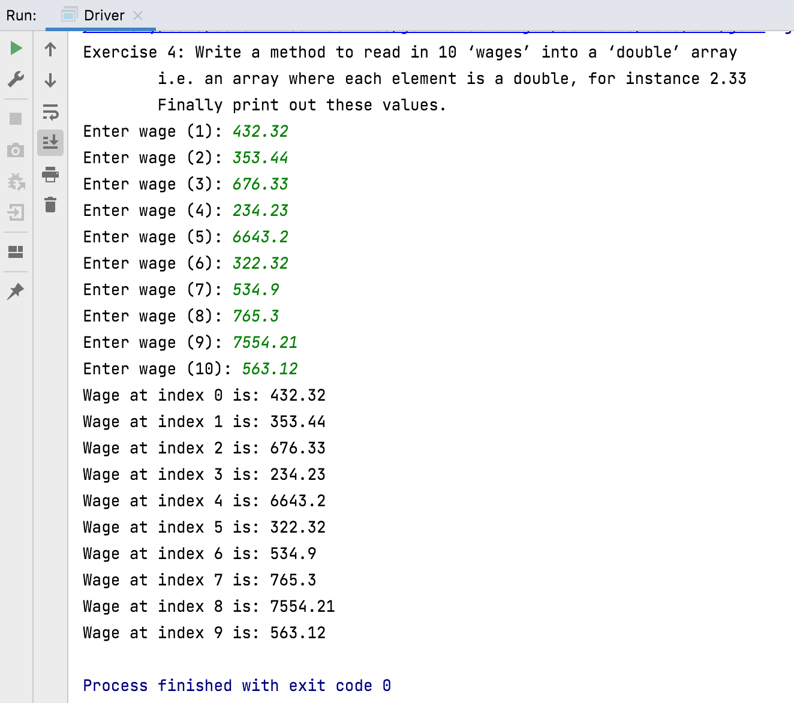
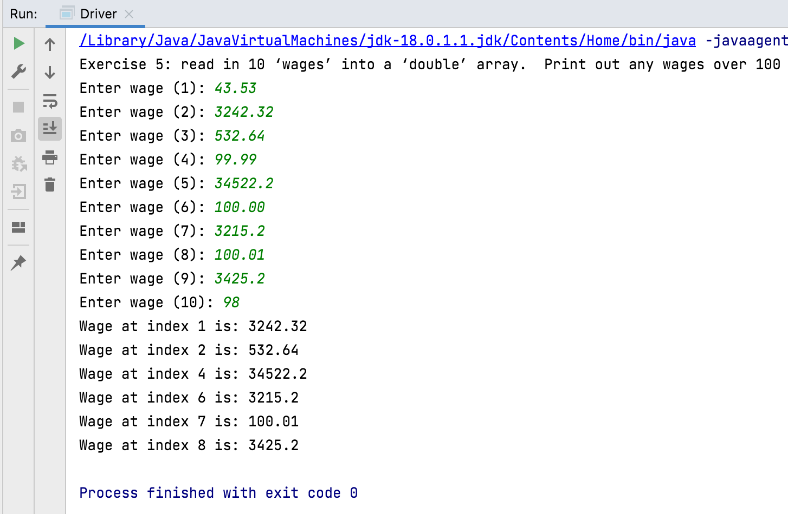
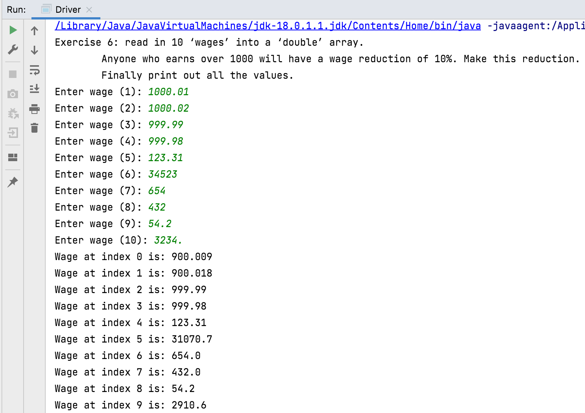
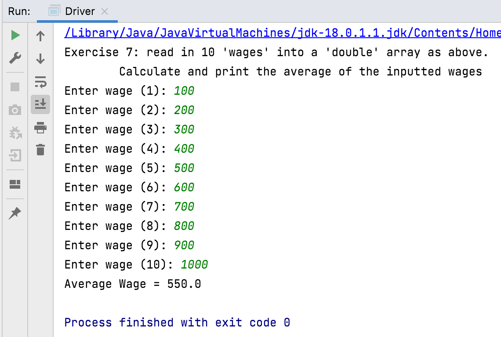
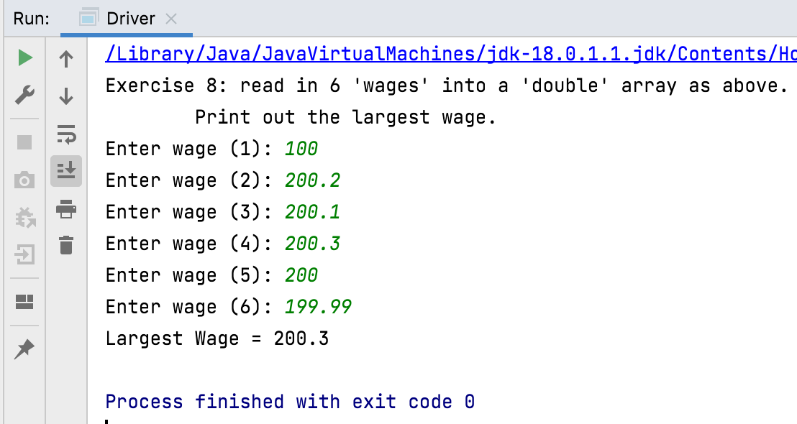
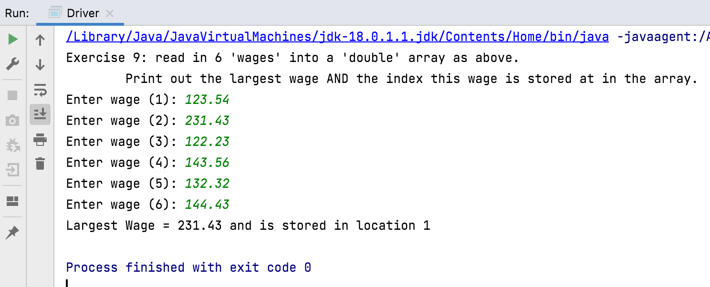

# Exercises - double

## Exercise 4

Write a method to read in 10 ‘wages’ into a ‘double’ array (i.e. an array where each element is a double value, for instance 2.33). Finally print out these values. Call this method `exercise4`.

## Exercise 5

Write a method similar to above , i.e. read in 10 ‘wages’ into a ‘double’ array (i.e. an array where each element is a double, for instance 2.33). This time only print out any wages over 100. Call this `exercise5`.

## Exercise 6

Similar to above, i.e. Read in 10 ‘wages’ into a ‘double’ array (i.e. an array where each element is a double, for instance 2.33). Anyone who earns over 1000 will have a wage deduction of 10%. Make this deduction. Finally print out all the values. Call this method `exercise6`.

## Exercise 7

Write a method to read in 10 'wages' into a 'double' array as above. Calculate and print the average of the inputted wages.  Call this method `exercise7`.

## Exercise 8

 Write a method to read in 6 'wages' into a 'double' array as above. Print out the largest wage in the array. Call this method `exercise8`.

## Exercise 9

 Write a method to read in 6 'wages' into a 'double' array as above. Print out the largest wage in the array and the index this wage is stored at in the array.  Call this method `exercise9`.

