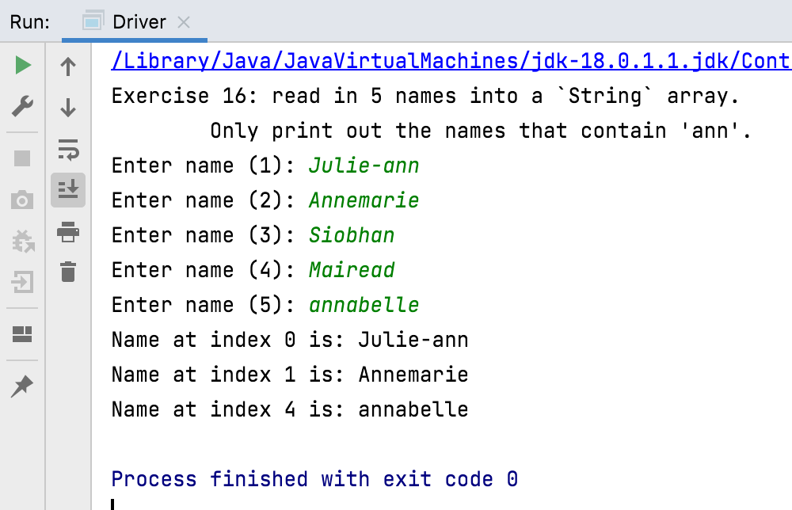

# Exercises - String

To complete the challenge exercises below, you may need to refer to the methods that are available for `String` variables:

- <https://docs.oracle.com/en/java/javase/18/docs/api/java.base/java/lang/String.html>

## Exercise 10

Write a method, called `exercise10` that will read in 5 names into a `String` array. Each name should then be printed out to the console.

## Challenge Exercise 11

Write a method, called `exercise11` that will read in 5 names into a `String` array (as above).  This time, each name should be CAPITALISED (uppercase) when printing to the console.

## Challenge Exercise 12

Write a method, called `exercise12` that will read in 5 names into a `String` array (as above).  This time, each name should be converted to all lowercase when printing to the console.

## Challenge Exercise 13

Write a method, called `exercise13` that will read in 5 names into a `String` array (as above).  This time, only print out the names that have at least 7 characters in them.

## Challenge Exercise 14

Write a method, called `exercise14` that will read in 5 names into a `String` array (as above).  This time, only print out the first 3 characters of each name to the console.

## Challenge Exercise 15

Write a method, called `exercise15` that will read in 5 names into a `String` array (as above).  This time, only print out the first 3 characters in UPPERCASE of each name to the console.

## Challenge Exercise 16

Write a method, called `exercise16` that will read in 5 names into a `String` array (as above).  This time, only print out the names that contain `ann`.

Note how the search above is case sensitive...i.e. it will only find lowercase `ann` and won't find the second entry `Annemarie`.  See can you work out a solution for this.

