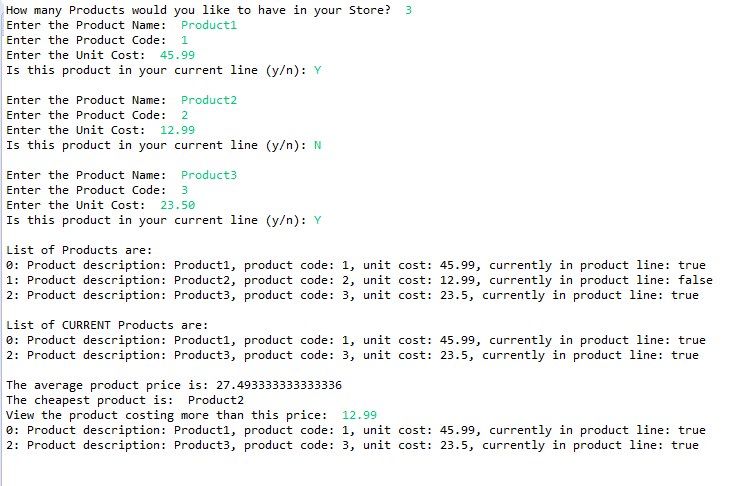

[BACK](/topics/topic10/lab10/01.html) [NEXT](/topics/topic10/lab10/03.html)

## ShopV2.1 - Methods Operating on Arrays

In IntelliJ, create a new project called **ShopV2.1**.

Copy your completed ShopV2.0 java files (Driver, Store and Product) into this new project.  Alternatively, you can use our solution: [ShopV2.0](archives/ShopV2.0.zip).

In this step, we will add a four new methods to the Store class so that we can do things like:

- list the products that are in the current product line (testing the boolean variable here).
- list the cheapest product entered.
- list the average product price.
- list the products above a specific price (read from the user and passed as a parameter).

Then we will call these methods from the Driver class and print the output to the console.

You may need to refer to your lecture notes for help with coding this version of Shop.

###  Store Class - listCurrentProducts

In Store, add a new method with the signature `public String listCurrentProducts()`

Within this method, add code to handle the following:

- If the array is empty, return the String "No products in the store".

- If the array is not empty, build a String containing the details off all entered products that are in the current product line (i.e. where isInCurrentProductLine() returns true) and return it.

### Store Class - cheapestProduct

In Store, add a new method with the signature `public Product cheapestProduct()`

Within this method, add code to handle the following:

- If the array is empty, return null.

- If the array is not empty, traverse the array to find the cheapest product based on the unit cost price.  Return the cheapest product as an object (note: don't just return the price; return the whole object).

### Store Class - averageProductPrice

In Store, add a new method with the signature `public double averageProductPrice()`

Within this method, add code to handle the following:

- If the array is empty, return -1.

- If the array is not empty, traverse the array, adding the unit cost for each entered product together.  When you have finised traversing the array, divide the total unit cost by the number of items entered (i.e. the total field). Return the result of this calculation.

### Store Class - listProductsAboveAPrice

In Store, add a new method with the signature `public String listProductsAboveAPrice(double price)`

Within this method, add code to handle the following:

- If the array is empty, return the String "No products in the store".

- If the array is not empty, build a String containing the details off all entered products whose unit cost is above that of the price entered as a parameter.  When finished traversing the array, return the built String.

### Driver Class

Having written four new methods in the Store Class, we will need to write code in the Driver class to call them (and test them).

This is the current main method in Driver:

~~~java
    public static void main(String[] args) {
		Driver driver = new Driver();
		driver.processOrder();
		driver.printProducts();
	}
~~~

Update your main method to make additional method calls:

~~~java
    public static void main(String[] args) {
		Driver driver = new Driver();
		driver.processOrder();
		driver.printProducts();
        driver.printCurrentProducts();
        driver.printAverageProductPrice();
        driver.printCheapestProduct();
        driver.printProductsAboveAPrice();
	}
~~~

#### printCurrentProducts()

The code for the `printCurrentProducts()` method is here...TYPE in the code into your Driver class:

~~~java
    //print out a list of all current products i.e. that are in the current product line.
    private void printCurrentProducts(){
        System.out.println("List of CURRENT Products are:");
        System.out.println(store.listCurrentProducts());
    }
~~~

Note how we called the method `listCurrentProducts()` in the Store class...we called it over the object of type Store, namely `store`.  

#### printAverageProductPrice()

Next, add the method `private void printAverageProductPrice()` to Driver.  In this method, add code that will give you the following processing:

- Over the `store` object, call the `averageProductPrice()` method.  The return type of this method is a double, so let's store the returned amount in a variable called `averagePrice`.

- Now interrogate the `averagePrice` variable.  If it contains a -1, then print "There are no products in the store" to the console.  Otherwise print "The average product price is: " along with the value stored in `averagePrice` to the console.

#### printCheapestProduct()

Now add an new method `private void printCheapestProduct()` to Driver.  This method should:

- call the `cheapestProduct()` method over the `store` object.  The return type of this method is a Product, so let's store the returned object in a variable called `cheapestProduct`.

- if the `cheapestProduct` object contains `null`, print "There are no products in the store." to the console.

- otherwise, print "The cheapest product is:  " followed by the productName of the `cheapestProduct`.

#### printProductsAboveAPrice()

Now add an new method `private void printProductsAboveAPrice()` to Driver.  This method should:

- print the following prompt to the console "View the products costing more than this price:  "

- read in the double value entered by the user and store it in a variable called `price`.

- call the `listProductsAboveAPrice(price)` method over the `store` object and print what is returned to the console.

### Run the Code

When you run your code it should look something like this:

Save your work.
